Predictive skill
================
Timo Kelder
October 19, 2019

Reliability of the forecasts
----------------------------

How can we trust the reliability of large ensembles? The idea of the large ensemble is that we can see 'unseen' extreme events, how can we validate extremes that have not been observed?
In event attribution, the validity of simulated extremes in large ensembles is typically based on the mean state and the ability to simulate the relevant physical processes ( [Angelil et al., 2016;](https://www.sciencedirect.com/science/article/pii/S2212094716300202#s0040) [Vautard et al., 2019](https://link.springer.com/article/10.1007%2Fs00382-018-4183-6)). In addition to these requirements, the forecasts should be reliable. A model is reliable when the forecast probability of occurrence matches the frequency of occurrences in the observations. For example, when the model predicts a probability of 30% for an extreme event to occur, in 30% of these cases this should occur in reality. [Antje et al., 2016](https://rmets.onlinelibrary.wiley.com/doi/full/10.1002/qj.2976) suggested that we can use reliability scores that have been developed for numerical weather predictions to test the reliability of extremes in large ensembles. Recently, [Bellprat et al., 2019](https://www.nature.com/articles/s41467-019-09729-2) has argued that assessing the reliability of extremes and correcting for models is a must for reliable extreme weather and climate event attribution.

We create a large ensemble of extreme precipitation from the ECMWF SEAS5 system [Johnson et al., 2019](https://www.geosci-model-dev.net/12/1087/2019/gmd-12-1087-2019.pdf). From the SEAS5 hindcasts, we extract 3-day seasonal maximum precipitation for each ensemble and each lead time for each year (4 lead times, 25 ensembles and 35 years: 1981-2016). The idea is that precipitation forecasts are not predictable after two weeks, and therefore the forecasts from different ensemble members and lead times can be seen as plausible realizations of the past. The aim of this large ensemble is to be able to detect and attribute changes in extreme events over the last 35 years. To justify the pooling of ensemble members and lead times, we have assessed the ensemble member independence and the model stability. In this notebook, I would like to further discuss the reliability of extremes in the large ensemble and it's trend over last 35 years. From the references in the previous paragraph, I think that we can define three requirements that are applicable to this method: 1) the changes of the mean state of the model must match the observations within uncertainty bounds 2) the physical processes leading to extreme precipitation must be realistic simulated in SEAS5 and 3) the frequency of extreme precipitation in the model must match the observations.

In this study, we use Norway and Svalbard as a case study to explore the validity of using SEAS5 to analyze trends in extreme precipitation ('UNSEEN' trends). These regions have recently faced severe events, raising the question whether these kind of events have occurred by chance or a the new norm. From observations, it is impossible to analyze the changes in these severe events: How have the 100-year precipitation events changed over last 35 years? With the SEAS5 large ensemble we can try to answer this question. But how realistic are the SEAS5 trends?

### 1) SEAS5 changes in mean states and teleconnections

[Johnson et al., 2019](https://www.geosci-model-dev.net/12/1087/2019/gmd-12-1087-2019.pdf) provide a thorough evaluation of the ECMWF SEAS5 system. The system follows carbon dioxide levels, and therefore is able to follow global temperature variability. There is a moderate skill in the North Atlantic Oscilation within SEAS5, and the observations fall mostly within the uncertainty ranges of the model. The model is known to have biases in the Arctic sea-ice extent in autumn and in the North Atlantic sea-surface temperature, which both might influence the reliability of the trend of extreme precipitation in SEAS5. The mean precipitation and temperature does follow observed variability for Norway and Svalbard (plots from Laura Ferranti, ECMWF). The trend in mean precipitation can be very different to the trend in extreme precipitation because of different mechanisms driving the trends.

### 2) Physical processes

The extreme precipitation events over this region are dominantely driven by atmospheric rivers (Azad,2017). Previous studies have demonstrated the capability of the ECMWF atmospheric model to simulate atmospheric rivers for Northern Europe (Lavers). This gives confidence in the SEAS5 system to be able to simulate the right physical processes of the large-scale build-up of extreme precipitation over Norway and Svalbard. However, these regions are mountaineous and characterised by large topographic variability. The small-scale processes in these mountaineous areas cannot be resolved in a global model with 36 km resolution. Therefore, the averaged extreme precipitation over a larger domain is more reliable than the spatial variability of the extreme precipitation. We evaluate the extreme precipitation averaged over the West Coast of Norway to a gridded precipitation record (SeNorge). We upscale this gridded product to the same resolution as SEAS5 and calculate the average of the same West Coast domain and find that the forecasts do have a lower bias in the simulation of three-day extreme precipitation events. After mean bias correction, we find that the observed values are randomly distributed amongst the ranked members of the ensemble in each year, indicating that the forecasted values can be seen as plausible realizations of reality (right?).

### 3) Frequency of simulated extremes

The reliability plot, as suggested by Antje and Bellprat, indicates whether the forecasted probability of occurrence matches the observed frequency of occurrence and therefore indicates whether a system is reliable. In this section, I will try to apply this to our SEAS5 extreme precipitation ensemble. Extreme precipitation is defined as the maximum 3-day precipitation event within the SON season. We have 100 ensemble members (4 lead times x 25 members) for each year between 1981-2016.

Import data and packages

``` r
dir='//home/timok/timok/SALIENSEAS/SEAS5/ensex'
plotdir=paste0(dir,'/statistics/multiday/plots')
source('Load_data.R')
```

First, we select a threshold for an event we are trying to forecast. Following Bellprat, we use the 1-in-5-year event. We plot the ensemble extremes along with the 1-in-5-year threshold.

``` r
require(plyr)
names(dimnames(Extremes_WC)) <- c('Member', 'Leadtime', 'Year')
df=adply(Extremes_WC, 1:3)
p= ggplot(df, aes(x=Year, y=V1, color=Leadtime, shape=Leadtime)) +
  theme_classic() 

p1= p +   geom_boxplot() +
  geom_hline(yintercept=quantile(Extremes_WC,0.8)) +
  scale_color_brewer(palette="Dark2") + 
  scale_x_discrete(breaks=seq(1981,2016,5)) +
  labs(x = NULL, y = 'Precipitation')

p1
```

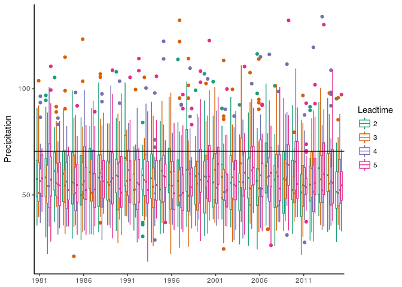

``` r
# ggsave(p1, filename = paste0(plotdir,"/ggplot.png"), dpi = 100, type = "cairo")
```

So what is the forecast probability of this event occurring? It is the amount of forecast above the threshold/total amount of forecast

``` r
by_ld_yr <- df %>% group_by(Leadtime, Year)
count_by_ld_yr <- by_ld_yr %>% tally(V1>quantile(df$V1,0.8))
count_by_ld_yr
```

    ## # A tibble: 140 x 3
    ## # Groups:   Leadtime [4]
    ##    Leadtime Year      n
    ##    <fct>    <fct> <int>
    ##  1 2        1981      5
    ##  2 2        1982      5
    ##  3 2        1983      6
    ##  4 2        1984      7
    ##  5 2        1985      6
    ##  6 2        1986      4
    ##  7 2        1987      7
    ##  8 2        1988      6
    ##  9 2        1989      5
    ## 10 2        1990      5
    ## # … with 130 more rows

``` r
p= ggplot(count_by_ld_yr, aes(x=Year, y=n, color=Leadtime, shape=Leadtime)) +
  theme_classic() 

p1= p +   geom_point() +
  scale_color_brewer(palette="Dark2") + 
  scale_x_discrete(breaks=seq(1981,2016,5)) +
  labs(x = NULL, y = 'Counts of Precipitation > 5yr')

p1
```

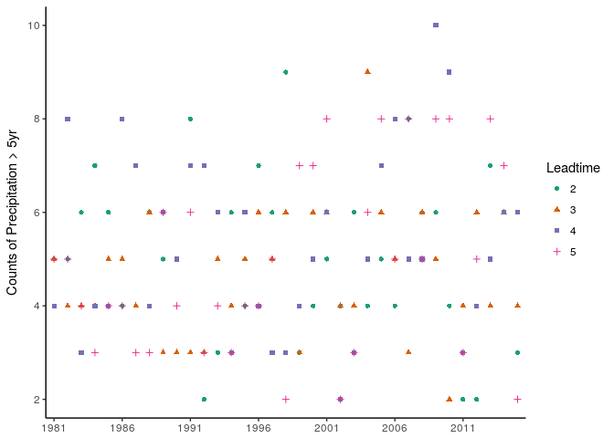

``` r
probs_by_ld_yr <- count_by_ld_yr %>% 
  mutate(probs = n / 25)

p= ggplot(probs_by_ld_yr, aes(x=Year, y=probs, color=Leadtime, shape=Leadtime,group=Leadtime)) +
  theme_classic() 

p1= p + 
  geom_point() +
  geom_line() +
  scale_color_brewer(palette="Dark2") + 
  scale_x_discrete(breaks=seq(1981,2016,5)) +
  labs(x = NULL, y = 'Probability of Precipitation > 5yr')

p1
```


How to compare the forecasted probability to observed events?

``` r
obs=Extremes_obs[as.character(1981:2015)]
count_obs=as.integer(obs>quantile(obs,0.8))
plot(1981:2015,count_obs)
```


Compare the probability with an event occurring to the observed occurrences.

``` r
pred= as.vector(unlist(probs_by_ld_yr[probs_by_ld_yr[,'Leadtime']=='2',4])) #Just select lead time 2, ugly coding :(
obs=count_obs

bins=10
bin.pred <- cut(pred, bins) ##Divide the predicted probabilities in bins

##Calculate the observed frequency for each bin of predicted probabilities. Dont know if this works properly. Source: http://danielnee.com/tag/reliability-diagram/

k <- ldply(levels(bin.pred), function(x) {  
  idx <- x == bin.pred
  c(sum(count_obs[idx]) / length(count_obs[idx]), mean(pred[idx]))
})

is.nan.idx <- !is.nan(k$V2)
k <- k[is.nan.idx,]  
plot(k$V2, k$V1, xlim=c(0,1), ylim=c(0,1), xlab="Mean Prediction", ylab="Observed Fraction", col="red", type="o", main="Reliability Plot")
lines(c(0,1),c(0,1), col="grey")
```


``` r
plot(hist(pred, xlab="", ylab="", main="", xlim=c(0,1), col="blue"), grconvertX(c(.8, 1), "npc"), grconvertY(c(0.08, .25), "npc"))
```

    ## Warning in if (freq) x$counts else x$density: the condition has length > 1
    ## and only the first element will be used

    ## Warning in if (!freq) "Density" else "Frequency": the condition has length
    ## > 1 and only the first element will be used

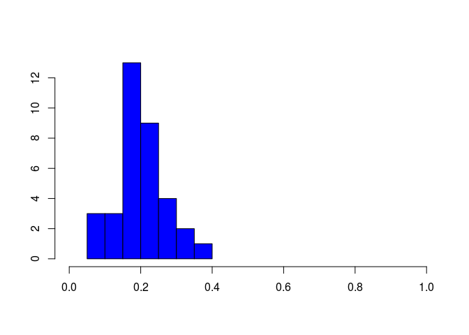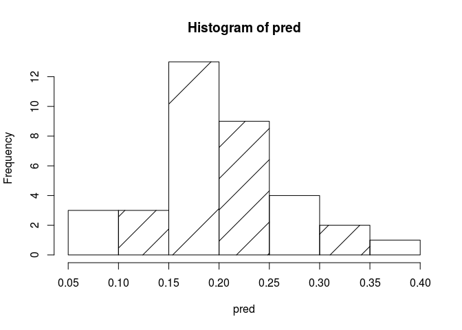

Hmm, looks odd. Let's compare it to the verification package

``` r
require(verification)
A<- verify(obs, pred, frcst.type = "prob", obs.type = "binary")
```

    ## If baseline is not included, baseline values  will be calculated from the  sample obs.

``` r
reliability.plot(A, titl = "Alternative plot")
```

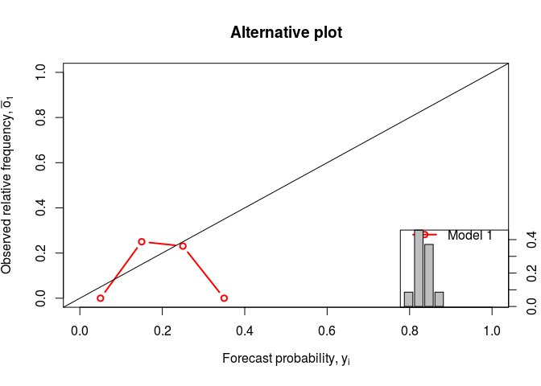

I guess that the 7 observations of a 5-year event do not allow for a robust analysis..

``` r
Quantile=0.5
probs_by_ld_yr <- df %>% group_by(Leadtime, Year) %>% tally(V1>quantile(df$V1,Quantile)) %>% mutate(probs = n / 25)
pred= as.vector(unlist(probs_by_ld_yr[probs_by_ld_yr[,'Leadtime']=='2',4])) #Just select lead time 2, ugly coding :(

count_obs=as.integer(obs>quantile(obs,Quantile))
plot(1981:2015,count_obs)
```


``` r
A<- verify(count_obs, pred, frcst.type = "prob", obs.type = "binary")
```

    ## If baseline is not included, baseline values  will be calculated from the  sample obs.

``` r
reliability.plot(A, titl = "Alternative plot")
```

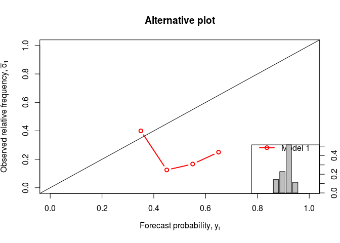

``` r
obs=predictand_anomaly
pred=apply(Extremes_WC,MARGIN = c(1,2) , FUN=calc_anomaly)

rank.histogram <- function(pred,obs=NULL) {
  
  N <- dim(pred)[1]
  K <- dim(pred)[2]
  
  ranks <- apply(cbind(obs, pred), 1, rank, ties.method="random")[1, ]
  rank.hist <- hist(ranks, breaks=seq(0.5, K+1.5))[["counts"]]
}

# apply(pred, MARGIN = 3, rank.histogram) #What am I doing wrong?

rank.histogram(pred[,,1],obs)
```

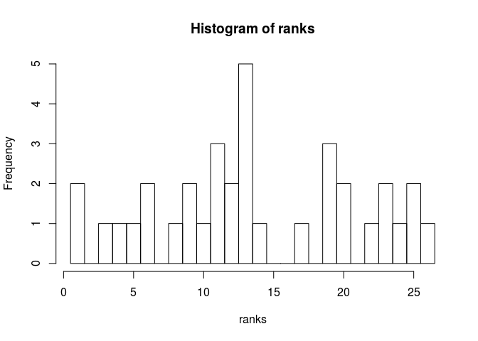

``` r
rank.histogram(pred[,,2],obs)
```

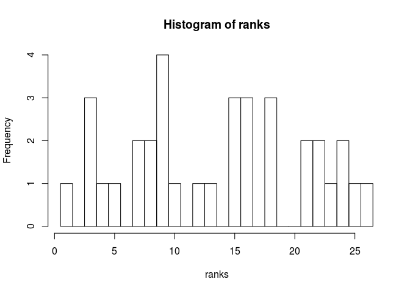

``` r
rank.histogram(pred[,,3],obs)
```

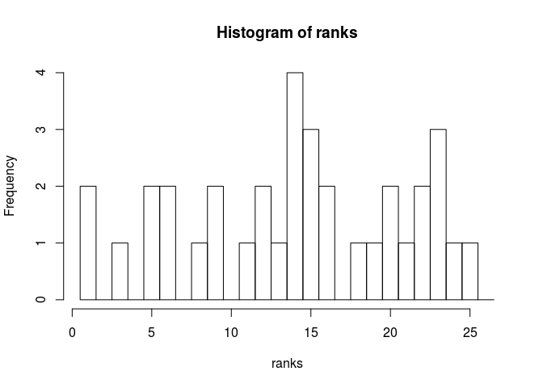

``` r
rank.histogram(pred[,,4],obs)
```

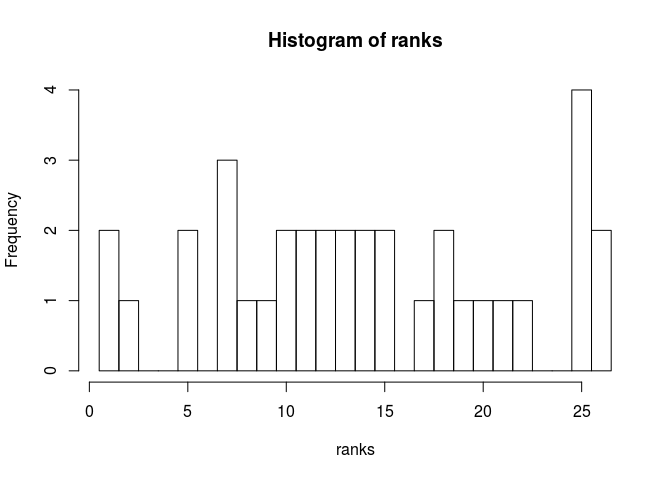

``` r
rank.histogram(cbind(pred[,,1],pred[,,2],pred[,,3],pred[,,4]),obs)
```

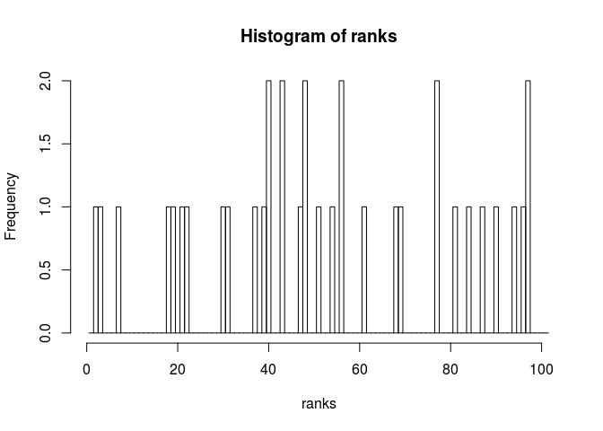
