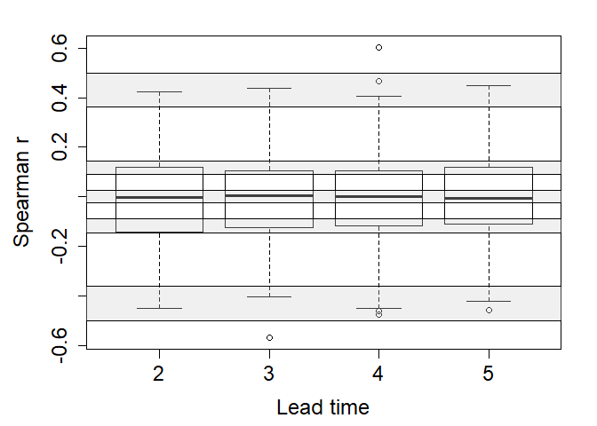

Independence test
================
Timo Kelder
October 19, 2019

In this notebook, we will test the independence of the UNSEEN ensembles
for Norway and for Svalbard.

## Import data and packages

``` r
## A list with directories used
# dir='//home/timok/timok/SALIENSEAS/SEAS5/ensex'
# plotdir=paste0(dir,'/statistics/multiday/plots')
# dir='/home/timok/ensex'
# plotdir='/home/timok/Documents/ensex/R/graphs'
dir='C:/Users/gytk3/OneDrive - Loughborough University/GitHub/EnsEx/Data'

##Load the data
source('Load_data.R')
```

    ## -- Attaching packages -------------------------------------------------------------------------------- tidyverse 1.3.0 --

    ## v tibble  2.1.3     v dplyr   0.8.3
    ## v tidyr   1.0.0     v stringr 1.4.0
    ## v readr   1.3.1     v forcats 0.4.0
    ## v purrr   0.3.3

    ## -- Conflicts ----------------------------------------------------------------------------------- tidyverse_conflicts() --
    ## x dplyr::arrange()   masks plyr::arrange()
    ## x purrr::compact()   masks plyr::compact()
    ## x dplyr::count()     masks plyr::count()
    ## x dplyr::failwith()  masks plyr::failwith()
    ## x dplyr::filter()    masks stats::filter()
    ## x dplyr::id()        masks plyr::id()
    ## x dplyr::lag()       masks stats::lag()
    ## x dplyr::mutate()    masks plyr::mutate()
    ## x dplyr::rename()    masks plyr::rename()
    ## x dplyr::summarise() masks plyr::summarise()
    ## x dplyr::summarize() masks plyr::summarize()

\#\#Indepence testing between the first en second member

While the day-to-day variability of the SON-3DP forecasts might not
correlate over the season, the maximum seasonal SON-3DP events might.
Thus, we test the independence of the SON-3DP ensemble member forecasts
by first selecting the seasonal maximum event for each forecast and
concatenate these events to create a 35-year timeseries (we refer to
Fig. 1a,b,c in the paper).

The extraction of the SON-3DP events is what we define as \`mining’ (see
the [data section](../README.md)) and results in two UNSEEN ensembles:
for Norway and for Svalbard. These ensembles are loaded as two arrays
with three dimensions: Ensemble member, Lead time and Year. The observed
just has one dimension: years.

``` r
# The UNSEEN ensemble for the West Coast of Norway
dim(Extremes_WC) # 25 4 35 Ensemble Leadtime Year 
```

    ## [1] 25  4 35

``` r
dimnames(Extremes_WC)
```

    ## [[1]]
    ##  [1] "0"  "1"  "2"  "3"  "4"  "5"  "6"  "7"  "8"  "9"  "10" "11" "12" "13" "14"
    ## [16] "15" "16" "17" "18" "19" "20" "21" "22" "23" "24"
    ## 
    ## [[2]]
    ## [1] "2" "3" "4" "5"
    ## 
    ## [[3]]
    ##  [1] "1981" "1982" "1983" "1984" "1985" "1986" "1987" "1988" "1989" "1990"
    ## [11] "1991" "1992" "1993" "1994" "1995" "1996" "1997" "1998" "1999" "2000"
    ## [21] "2001" "2002" "2003" "2004" "2005" "2006" "2007" "2008" "2009" "2010"
    ## [31] "2011" "2012" "2013" "2014" "2015"

``` r
# The UNSEEN ensemble for the West Coast of Norway
dim(Extremes_SV)
```

    ## [1] 25  4 35

``` r
dimnames(Extremes_SV)
```

    ## [[1]]
    ##  [1] "0"  "1"  "2"  "3"  "4"  "5"  "6"  "7"  "8"  "9"  "10" "11" "12" "13" "14"
    ## [16] "15" "16" "17" "18" "19" "20" "21" "22" "23" "24"
    ## 
    ## [[2]]
    ## [1] "2" "3" "4" "5"
    ## 
    ## [[3]]
    ##  [1] "1981" "1982" "1983" "1984" "1985" "1986" "1987" "1988" "1989" "1990"
    ## [11] "1991" "1992" "1993" "1994" "1995" "1996" "1997" "1998" "1999" "2000"
    ## [21] "2001" "2002" "2003" "2004" "2005" "2006" "2007" "2008" "2009" "2010"
    ## [31] "2011" "2012" "2013" "2014" "2015"

``` r
# The observed events
dim(Extremes_obs)
```

    ## [1] 62

``` r
obs=Extremes_obs[as.character(1981:2015)]
dimnames(obs)
```

    ## [[1]]
    ##  [1] "1981" "1982" "1983" "1984" "1985" "1986" "1987" "1988" "1989" "1990"
    ## [11] "1991" "1992" "1993" "1994" "1995" "1996" "1997" "1998" "1999" "2000"
    ## [21] "2001" "2002" "2003" "2004" "2005" "2006" "2007" "2008" "2009" "2010"
    ## [31] "2011" "2012" "2013" "2014" "2015"

To assess the independence between each of the ensemble members, we
calculate the Spearman rank correlation coefficient (ρ) for every pair
of ensemble members (Fig. 1d in the paper). Here we show how this looks
like for the correlation between the first two ensemble members for the
first lead time for Norway.

``` r
## 
Extremes_array= Extremes_WC# Select the domain average precipitation extremes for Svalbard 

#To test the independence, we performe a pairwise correlation test between all ensemble members
predictant=as.vector(Extremes_array[1,'2',]) #First member, first leadtime that we use in this study
predictor=as.vector(Extremes_array[2,'2',]) #Second member, first leadtime that we use in this study

#Standarized anomaly
predictant_anomaly=(predictant-mean(predictant))/sd(predictant)
predictor_anomaly=(predictor-mean(predictor))/sd(predictor)

#Use spearman to avoid normality assumptions
cor_coeff='spearman'
correlation=cor.test(predictant_anomaly,predictor_anomaly,alternative = 'two.sided',method = cor_coeff) 

##And plot the correlation for these two members
par(mar=c(4.5,5.1,2.1,2.1),cex.axis=1.5, cex.lab=1.5,cex.main=1.5)
plot(predictant_anomaly,predictor_anomaly, xlim=c(min(predictor_anomaly,predictant_anomaly),max(predictor_anomaly,predictant_anomaly)),ylim=c(min(predictor_anomaly,predictant_anomaly),max(predictor_anomaly,predictant_anomaly)),
     xlab='Standardized anomaly member 00', ylab='Standardized anomaly member 01')
lines(c(-5,5),c(-5,5))
text(0.4*min(predictor_anomaly,predictant_anomaly),0.8*max(predictor_anomaly,predictant_anomaly),
     bquote(atop("Spearman" ~ r== .(round(correlation$estimate,digits = 3)),
                 'p value' == .(round(correlation$p.value,digits = 3)))),cex=1.3)
legend("bottomright", legend=c("1:1 line"),lty=1,cex=1.3)
```

<!-- -->

## Independence testing for all ensemble members

In total, there are 300 distinct pairings for each lead time. Here we
calculate the ρ values for each pair.

``` r
##Perform the pairwise test
correlations_lds=array(dim = c(25,25,4),dimnames = list(as.character(0:24),as.character(0:24),as.character(2:5))) # create and array to fill the correlations in 
#lds, mbmrs
for (ld in 2:5){
  for (mbr1 in 1:25){
    for (mbr2 in 1:25){
        
      if (mbr1>mbr2){ ## Only calculate this for the top half of the correlation matrix, as not to duplicate any values -> avoid correlating mbr 1 with mbr2 and then mbr2 with mbr 1.
        predictant=as.vector(Extremes_array[mbr1,as.character(ld),])
        predictor=as.vector(Extremes_array[mbr2,as.character(ld),])
        # predictor=as.vector(apply(Extremes_array[-mbr,as.character(ld),],FUN = mean , MARGIN=c(2)))
        
        predictant_anomaly=(predictant-mean(predictant))/sd(predictant)
        predictor_anomaly=(predictor-mean(predictor))/sd(predictor)
        
        correlations_lds[mbr1,mbr2,as.character(ld)]=cor(predictant_anomaly,predictor_anomaly,method = cor_coeff)
      }
    }
  }
}

#Check where the correlation is the same as the one estimated in the previous chunk
correlations_lds[2,1,'2']==correlation$estimate
```

    ##  rho 
    ## TRUE

``` r
##And plot the result
par(mar=c(4.5,5.1,2.1,2.1),cex.axis=1.5, cex.lab=1.5,cex.main=1.5)
boxplot(list(correlations_lds[,,'2'],correlations_lds[,,'3'],correlations_lds[,,'4'],correlations_lds[,,'5']),
        xaxt="n",xlab='Lead time',ylab=bquote('Spearman'~r))
Axis(side=1,at=1:5,labels = c(as.character(2:5),'all'))
```

<!-- -->

## Bootstrap test

To test whether the correlations are significant, we perform a bootstrap
test.

``` r
  Bootstrap <- function(Extremes_array) {
    
    Extremes_resampled=sample(x=Extremes_array, size=3500, replace = FALSE) #First, resample to make the data uncorrelated
    Extremes_array_resampled=array(Extremes_resampled,dim = c(25,4,35),dimnames = list(as.character(0:24),as.character(2:5),as.character(1981:2015))) ## rename it 
    
    correlations_lds_resampled=array(dim = c(25,25,4),dimnames = list(as.character(0:24),as.character(0:24),as.character(2:5))) #lds, mbmrs
    for (ld in 2:5){
      for (mbr1 in 1:25){
        for (mbr2 in 1:25){
          
          if (mbr1>mbr2){
            predictant=as.vector(Extremes_array_resampled[mbr1,as.character(ld),])
            predictor=as.vector(Extremes_array_resampled[mbr2,as.character(ld),])
            # predictor=as.vector(apply(Extremes_array[-mbr,as.character(ld),],FUN = mean , MARGIN=c(2)))
            
            predictant_anomaly=(predictant-mean(predictant))/sd(predictant)
            predictor_anomaly=(predictor-mean(predictor))/sd(predictor)
            
            correlations_lds_resampled[mbr1,mbr2,as.character(ld)]=cor(predictant_anomaly,predictor_anomaly,method = cor_coeff)
          }
        }
      }
    }
    a=boxplot(list(correlations_lds_resampled[,,'2'],correlations_lds_resampled[,,'3'],correlations_lds_resampled[,,'4'], correlations_lds_resampled[,,'5']), plot = F)
           return(a$stats)
  }
  
correlations_lds_bootstrapped=replicate(1000,Bootstrap(Extremes_array))

Quantiles=c(0.025,0.975)
Quantiles_fun <- function(x) {quantile(x,Quantiles,na.rm=T)}
CI_bounds_boxplots=apply(correlations_lds_bootstrapped[,,], MARGIN = 1,Quantiles_fun ) #We resample 1000 times for 4 leadtimes. Resulting in 4000 quantiles based on 300 pairs of correlations. 

# png(paste0('//home/timok/timok/SALIENSEAS/SEAS5/ensex/statistics/multiday/plots/Predictability_lds_resampled_SV.png'),type='cairo')
# dev.off()
```

``` r
##And plot
par(mar=c(4.5,5.1,2.1,2.1),cex.axis=1.5, cex.lab=1.5,cex.main=1.5)
boxplot(list(correlations_lds[,,'2'],correlations_lds[,,'3'],correlations_lds[,,'4'],correlations_lds[,,'5']),
        xaxt="n",xlab='Lead time',ylab=bquote('Spearman'~r))
for (i in 1:length(CI_bounds_boxplots[1,]))  {
  polygon(c(0,6,6,0),c(rep(CI_bounds_boxplots[1,i],2),rep(CI_bounds_boxplots[2,i],2)),col=gray(0.8,alpha=0.3))}
  # lines(0:6,rep(CI_bounds_boxplots[1,i],7))
  # text(1,CI_bounds_boxplots[1,i],bquote('threshold'~r),cex=1.3)
  # lines(0:6,rep(CI_bounds_boxplots[2,i],7))
  # text(1,CI_bounds_boxplots[2,i],bquote('threshold'~r),cex=1.3)
  # }
Axis(side=1,at=1:5,labels = c(as.character(2:5),'all'))
```

<!-- -->
