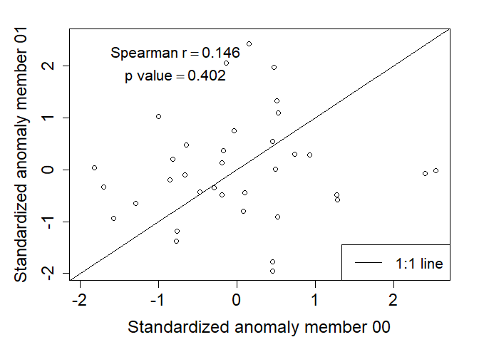

Independence test
================
Timo Kelder
October 19, 2019

In this notebook, we will test the independence of the UNSEEN ensembles
for Norway and for Svalbard.

## Import data and packages

``` r
## A list with directories used
# dir='//home/timok/timok/SALIENSEAS/SEAS5/ensex'
# plotdir=paste0(dir,'/statistics/multiday/plots')
# dir='/home/timok/ensex'
# plotdir='/home/timok/Documents/ensex/R/graphs'
dir='C:/Users/gytk3/OneDrive - Loughborough University/GitHub/EnsEx/Data'

##Load the data
source('Load_data.R')
```

    ## -- Attaching packages -------------------------------------------------------------------------------- tidyverse 1.3.0 --

    ## v tibble  2.1.3     v dplyr   0.8.3
    ## v tidyr   1.0.0     v stringr 1.4.0
    ## v readr   1.3.1     v forcats 0.4.0
    ## v purrr   0.3.3

    ## -- Conflicts ----------------------------------------------------------------------------------- tidyverse_conflicts() --
    ## x dplyr::arrange()   masks plyr::arrange()
    ## x purrr::compact()   masks plyr::compact()
    ## x dplyr::count()     masks plyr::count()
    ## x dplyr::failwith()  masks plyr::failwith()
    ## x dplyr::filter()    masks stats::filter()
    ## x dplyr::id()        masks plyr::id()
    ## x dplyr::lag()       masks stats::lag()
    ## x dplyr::mutate()    masks plyr::mutate()
    ## x dplyr::rename()    masks plyr::rename()
    ## x dplyr::summarise() masks plyr::summarise()
    ## x dplyr::summarize() masks plyr::summarize()

\#\#Indepence testing between the first en second member

While the day-to-day variability of the SON-3DP forecasts might not
correlate over the season, the maximum seasonal SON-3DP events might.
Thus, we test the independence of the SON-3DP ensemble member forecasts
by first selecting the seasonal maximum event for each forecast and
concatenate these events to create a 35-year timeseries (we refer to
Fig. 1a,b,c in the paper). This process is performed on the cluster of
MetNor [generating the UNSEEN
ensemble](Mining/Mine_regional_average.sh). by first selecting the
seasonal maximum event for each forecast and concatenate these events to
create a 35-year timeseries (Fig. 1a,b,c). To robustly assess the
independence between each of the ensemble members, we calculate the
Spearman rank correlation coefficient (ρ) for every pair of ensemble
members (Fig. 1d), resulting in 300 ρ values for each lead time.

``` r
## 
Extremes_array= Extremes_WC# Select the domain average precipitation extremes for Svalbard 

#To test the independence, we performe a pairwise correlation test between all ensemble members
predictant=as.vector(Extremes_array[1,'2',]) #First member, first leadtime that we use in this study
predictor=as.vector(Extremes_array[2,'2',]) #Second member, first leadtime that we use in this study

#Standarized anomaly
predictant_anomaly=(predictant-mean(predictant))/sd(predictant)
predictor_anomaly=(predictor-mean(predictor))/sd(predictor)

#Use spearman to avoid normality assumptions
cor_coeff='spearman'
correlation=cor.test(predictant_anomaly,predictor_anomaly,alternative = 'two.sided',method = cor_coeff) 

##And plot the correlation for these two members
par(mar=c(4.5,5.1,2.1,2.1),cex.axis=1.5, cex.lab=1.5,cex.main=1.5)
plot(predictant_anomaly,predictor_anomaly, xlim=c(min(predictor_anomaly,predictant_anomaly),max(predictor_anomaly,predictant_anomaly)),ylim=c(min(predictor_anomaly,predictant_anomaly),max(predictor_anomaly,predictant_anomaly)),
     xlab='Standardized anomaly member 00', ylab='Standardized anomaly member 01')
lines(c(-5,5),c(-5,5))
text(0.4*min(predictor_anomaly,predictant_anomaly),0.8*max(predictor_anomaly,predictant_anomaly),
     bquote(atop("Spearman" ~ r== .(round(correlation$estimate,digits = 3)),
                 'p value' == .(round(correlation$p.value,digits = 3)))),cex=1.3)
legend("bottomright", legend=c("1:1 line"),lty=1,cex=1.3)
```

<!-- -->

\#\#Independence testing for all ensemble members

``` r
##Perform the pairwise test
correlations_lds=array(dim = c(25,25,4),dimnames = list(as.character(0:24),as.character(0:24),as.character(2:5))) # create and array to fill the correlations in 
#lds, mbmrs
for (ld in 2:5){
  for (mbr1 in 1:25){
    for (mbr2 in 1:25){
        
      if (mbr1>mbr2){ ## Only calculate this for the top half of the correlation matrix, as not to duplicate any values -> avoid correlating mbr 1 with mbr2 and then mbr2 with mbr 1.
        predictant=as.vector(Extremes_array[mbr1,as.character(ld),])
        predictor=as.vector(Extremes_array[mbr2,as.character(ld),])
        # predictor=as.vector(apply(Extremes_array[-mbr,as.character(ld),],FUN = mean , MARGIN=c(2)))
        
        predictant_anomaly=(predictant-mean(predictant))/sd(predictant)
        predictor_anomaly=(predictor-mean(predictor))/sd(predictor)
        
        correlations_lds[mbr1,mbr2,as.character(ld)]=cor(predictant_anomaly,predictor_anomaly,method = cor_coeff)
      }
    }
  }
}

#Check where the correlation is the same as the one estimated in the previous chunk
correlations_lds[2,1,'2']==correlation$estimate
```

    ##  rho 
    ## TRUE

``` r
##And plot the result
par(mar=c(4.5,5.1,2.1,2.1),cex.axis=1.5, cex.lab=1.5,cex.main=1.5)
boxplot(list(correlations_lds[,,'2'],correlations_lds[,,'3'],correlations_lds[,,'4'],correlations_lds[,,'5']),
        xaxt="n",xlab='Lead time',ylab=bquote('Spearman'~r))
Axis(side=1,at=1:5,labels = c(as.character(2:5),'all'))
```

<!-- -->

\#Bootstrap test To test whether the correlations are significant, we
perform a bootstrap test.
