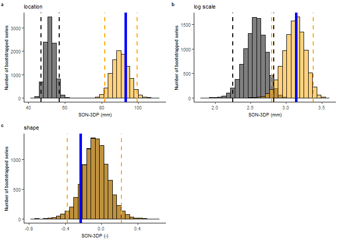
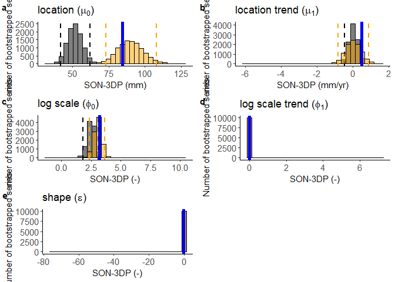
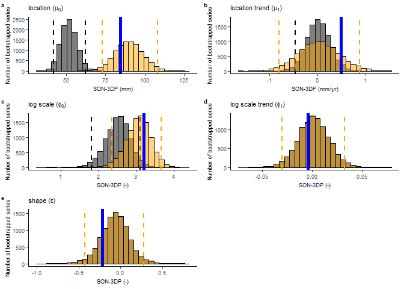

Trend analysis
================
Timo Kelder
November 13, 2019

In this notebook, we are going to perform trend analysis based on
extreme value theory. We will quantify the trend in the 100-year
precipitation extremes over time (1981-2015) for the West Coast of
Norway and for Svalbard.

## Import data and packages

``` r
dir='C:/Users/timo/OneDrive - Loughborough University/GitHub/UNSEEN-trends/Data'

source('Load_data.R')
```

    ## Warning: package 'ggplot2' was built under R version 3.6.3

    ## Warning: package 'plyr' was built under R version 3.6.3

    ## Warning: package 'tidyverse' was built under R version 3.6.3

    ## -- Attaching packages --------------------------------------------------------------------------------------------------------- tidyverse 1.3.0 --

    ## v tibble  3.0.3     v dplyr   0.8.3
    ## v tidyr   1.1.1     v stringr 1.4.0
    ## v readr   1.3.1     v forcats 0.5.0
    ## v purrr   0.3.3

    ## Warning: package 'tibble' was built under R version 3.6.3

    ## Warning: package 'tidyr' was built under R version 3.6.3

    ## Warning: package 'forcats' was built under R version 3.6.3

    ## -- Conflicts ------------------------------------------------------------------------------------------------------------ tidyverse_conflicts() --
    ## x dplyr::arrange()   masks plyr::arrange()
    ## x purrr::compact()   masks plyr::compact()
    ## x dplyr::count()     masks plyr::count()
    ## x dplyr::failwith()  masks plyr::failwith()
    ## x dplyr::filter()    masks stats::filter()
    ## x dplyr::id()        masks plyr::id()
    ## x dplyr::lag()       masks stats::lag()
    ## x dplyr::mutate()    masks plyr::mutate()
    ## x dplyr::rename()    masks plyr::rename()
    ## x dplyr::summarise() masks plyr::summarise()
    ## x dplyr::summarize() masks plyr::summarize()

``` r
library(moments)
library(extRemes)
```

    ## Loading required package: Lmoments

    ## Loading required package: distillery

    ## Warning: package 'distillery' was built under R version 3.6.3

    ## 
    ## Attaching package: 'distillery'

    ## The following object is masked from 'package:plyr':
    ## 
    ##     is.formula

    ## 
    ## Attaching package: 'extRemes'

    ## The following objects are masked from 'package:stats':
    ## 
    ##     qqnorm, qqplot

``` r
library("ggpubr")
```

    ## Warning: package 'ggpubr' was built under R version 3.6.3

    ## 
    ## Attaching package: 'ggpubr'

    ## The following object is masked from 'package:plyr':
    ## 
    ##     mutate

``` r
require(plyr)
names(dimnames(Extremes_WC)) <- c('Member', 'Leadtime', 'Year')
names(dimnames(Extremes_SV)) <- c('Member', 'Leadtime', 'Year')
df_WC=adply(Extremes_WC, 1:3) ## Convert the array with extremes to a data frame 
df_SV=adply(Extremes_SV, 1:3)
obs=Extremes_obs[as.character(1981:2015)]
ERA_wc = Extremes_ERA_wc$LSP[Extremes_ERA_wc$year < 2016] *1000
ERA_sv = Extremes_ERA_sv$LSP[Extremes_ERA_sv$year < 2016] 
```

\#Bootstrap median extremes (2-year events) Similar to comparing the
distribution of the unseen ensemble to the observations by
bootstrapping, here we test whether the observed trend falls within the
bootstrapped trends.

``` r
#Functions to fit the tests
fit_stat <- function(extremes, GEV_type = 'GEV') {
  fit <- fevd(extremes, type = GEV_type, use.phi = TRUE)
  return(fit$results$par)
}

fit_nonstat <- function(extremes, GEV_type = 'GEV', covariate = 1:35) {
  tryCatch(expr = {
    fit <- fevd(extremes,
                type = GEV_type,
                location.fun = ~ covariate, ##Fitting the gev with a location and scale parameter linearly correlated to the covariate (years)
                scale.fun = ~ covariate,
                use.phi = TRUE)
    return(fit$results$par)
    },
    error = function(e){
    message(paste0('Error! failed fit'))
    return(rep(NA,35))
      # Do this if an error is caught...
    })
}
```

## Bootstrap the west coast extremes

``` r
bootstrapped_array_WC = array(dim = c(35,10000))

for (i in 1:35){
  year = i + 1980
  # print(year)
  bootstrapped_array_WC[i,]=sample(df_WC$V1[df_WC$Year == year],size = 10000,replace = T) #For WC

}
  
## we create a mean bias corrected series  
bootstrapped_array_WC_biascor= bootstrapped_array_WC * mean(obs)/mean(df_WC$V1) 
```

``` r
## This is bootstrapping on the entire ensemble, instead we used a bootstrap for each year in the previous chunk.
# ## we create a mean bias corrected series  
# extremes_wc_biascor= df_WC$V1 * mean(obs)/mean(df_WC$V1) 
# 
# #Bootstraps the series to 35 years length with n= 10.000 
# bootstrapped_series_WC=sample(df_WC$V1,size = 35*10000,replace = T) #For WC
# bootstrapped_series_WC_biascor=sample(extremes_wc_biascor,size = 35*10000,replace = T) #For WC
# bootstrapped_array_WC=array(bootstrapped_series_WC,dim = c(35,10000)) #Creates an array with 10.000 series of 35 values
# bootstrapped_array_WC_biascor=array(bootstrapped_series_WC_biascor,dim = c(35,10000)) #Same for the mean bias corrected series
```

### Apply the stationary fit function to the obs and bootstrapped arrays

``` r
fit_obs = fit_stat(extremes = obs, GEV_type = 'GEV')
bootstrapped_fit = apply(bootstrapped_array_WC,MARGIN = 2,FUN = fit_stat)
```

    ## Warning in log(z): NaNs produced
    
    ## Warning in log(z): NaNs produced
    
    ## Warning in log(z): NaNs produced
    
    ## Warning in log(z): NaNs produced
    
    ## Warning in log(z): NaNs produced
    
    ## Warning in log(z): NaNs produced
    
    ## Warning in log(z): NaNs produced
    
    ## Warning in log(z): NaNs produced
    
    ## Warning in log(z): NaNs produced
    
    ## Warning in log(z): NaNs produced
    
    ## Warning in log(z): NaNs produced
    
    ## Warning in log(z): NaNs produced
    
    ## Warning in log(z): NaNs produced
    
    ## Warning in log(z): NaNs produced
    
    ## Warning in log(z): NaNs produced
    
    ## Warning in log(z): NaNs produced
    
    ## Warning in log(z): NaNs produced
    
    ## Warning in log(z): NaNs produced
    
    ## Warning in log(z): NaNs produced
    
    ## Warning in log(z): NaNs produced
    
    ## Warning in log(z): NaNs produced
    
    ## Warning in log(z): NaNs produced
    
    ## Warning in log(z): NaNs produced
    
    ## Warning in log(z): NaNs produced
    
    ## Warning in log(z): NaNs produced
    
    ## Warning in log(z): NaNs produced
    
    ## Warning in log(z): NaNs produced
    
    ## Warning in log(z): NaNs produced
    
    ## Warning in log(z): NaNs produced
    
    ## Warning in log(z): NaNs produced
    
    ## Warning in log(z): NaNs produced
    
    ## Warning in log(z): NaNs produced
    
    ## Warning in log(z): NaNs produced
    
    ## Warning in log(z): NaNs produced
    
    ## Warning in log(z): NaNs produced
    
    ## Warning in log(z): NaNs produced
    
    ## Warning in log(z): NaNs produced
    
    ## Warning in log(z): NaNs produced
    
    ## Warning in log(z): NaNs produced
    
    ## Warning in log(z): NaNs produced
    
    ## Warning in log(z): NaNs produced
    
    ## Warning in log(z): NaNs produced
    
    ## Warning in log(z): NaNs produced
    
    ## Warning in log(z): NaNs produced
    
    ## Warning in log(z): NaNs produced
    
    ## Warning in log(z): NaNs produced
    
    ## Warning in log(z): NaNs produced
    
    ## Warning in log(z): NaNs produced
    
    ## Warning in log(z): NaNs produced
    
    ## Warning in log(z): NaNs produced
    
    ## Warning in log(z): NaNs produced
    
    ## Warning in log(z): NaNs produced
    
    ## Warning in log(z): NaNs produced
    
    ## Warning in log(z): NaNs produced
    
    ## Warning in log(z): NaNs produced
    
    ## Warning in log(z): NaNs produced
    
    ## Warning in log(z): NaNs produced
    
    ## Warning in log(z): NaNs produced
    
    ## Warning in log(z): NaNs produced
    
    ## Warning in log(z): NaNs produced
    
    ## Warning in log(z): NaNs produced
    
    ## Warning in log(z): NaNs produced
    
    ## Warning in log(z): NaNs produced
    
    ## Warning in log(z): NaNs produced
    
    ## Warning in log(z): NaNs produced
    
    ## Warning in log(z): NaNs produced
    
    ## Warning in log(z): NaNs produced
    
    ## Warning in log(z): NaNs produced
    
    ## Warning in log(z): NaNs produced
    
    ## Warning in log(z): NaNs produced
    
    ## Warning in log(z): NaNs produced
    
    ## Warning in log(z): NaNs produced
    
    ## Warning in log(z): NaNs produced
    
    ## Warning in log(z): NaNs produced
    
    ## Warning in log(z): NaNs produced
    
    ## Warning in log(z): NaNs produced
    
    ## Warning in log(z): NaNs produced
    
    ## Warning in log(z): NaNs produced
    
    ## Warning in log(z): NaNs produced
    
    ## Warning in log(z): NaNs produced
    
    ## Warning in log(z): NaNs produced
    
    ## Warning in log(z): NaNs produced
    
    ## Warning in log(z): NaNs produced
    
    ## Warning in log(z): NaNs produced
    
    ## Warning in log(z): NaNs produced
    
    ## Warning in log(z): NaNs produced
    
    ## Warning in log(z): NaNs produced
    
    ## Warning in log(z): NaNs produced
    
    ## Warning in log(z): NaNs produced
    
    ## Warning in log(z): NaNs produced
    
    ## Warning in log(z): NaNs produced
    
    ## Warning in log(z): NaNs produced
    
    ## Warning in log(z): NaNs produced
    
    ## Warning in log(z): NaNs produced
    
    ## Warning in log(z): NaNs produced
    
    ## Warning in log(z): NaNs produced
    
    ## Warning in log(z): NaNs produced
    
    ## Warning in log(z): NaNs produced
    
    ## Warning in log(z): NaNs produced
    
    ## Warning in log(z): NaNs produced
    
    ## Warning in log(z): NaNs produced
    
    ## Warning in log(z): NaNs produced
    
    ## Warning in log(z): NaNs produced
    
    ## Warning in log(z): NaNs produced
    
    ## Warning in log(z): NaNs produced
    
    ## Warning in log(z): NaNs produced
    
    ## Warning in log(z): NaNs produced
    
    ## Warning in log(z): NaNs produced
    
    ## Warning in log(z): NaNs produced
    
    ## Warning in log(z): NaNs produced
    
    ## Warning in log(z): NaNs produced
    
    ## Warning in log(z): NaNs produced
    
    ## Warning in log(z): NaNs produced
    
    ## Warning in log(z): NaNs produced
    
    ## Warning in log(z): NaNs produced
    
    ## Warning in log(z): NaNs produced
    
    ## Warning in log(z): NaNs produced
    
    ## Warning in log(z): NaNs produced
    
    ## Warning in log(z): NaNs produced
    
    ## Warning in log(z): NaNs produced
    
    ## Warning in log(z): NaNs produced
    
    ## Warning in log(z): NaNs produced
    
    ## Warning in log(z): NaNs produced
    
    ## Warning in log(z): NaNs produced
    
    ## Warning in log(z): NaNs produced
    
    ## Warning in log(z): NaNs produced
    
    ## Warning in log(z): NaNs produced
    
    ## Warning in log(z): NaNs produced
    
    ## Warning in log(z): NaNs produced
    
    ## Warning in log(z): NaNs produced
    
    ## Warning in log(z): NaNs produced
    
    ## Warning in log(z): NaNs produced
    
    ## Warning in log(z): NaNs produced
    
    ## Warning in log(z): NaNs produced
    
    ## Warning in log(z): NaNs produced
    
    ## Warning in log(z): NaNs produced
    
    ## Warning in log(z): NaNs produced
    
    ## Warning in log(z): NaNs produced
    
    ## Warning in log(z): NaNs produced
    
    ## Warning in log(z): NaNs produced
    
    ## Warning in log(z): NaNs produced
    
    ## Warning in log(z): NaNs produced
    
    ## Warning in log(z): NaNs produced
    
    ## Warning in log(z): NaNs produced
    
    ## Warning in log(z): NaNs produced
    
    ## Warning in log(z): NaNs produced
    
    ## Warning in log(z): NaNs produced
    
    ## Warning in log(z): NaNs produced
    
    ## Warning in log(z): NaNs produced
    
    ## Warning in log(z): NaNs produced
    
    ## Warning in log(z): NaNs produced
    
    ## Warning in log(z): NaNs produced
    
    ## Warning in log(z): NaNs produced
    
    ## Warning in log(z): NaNs produced
    
    ## Warning in log(z): NaNs produced
    
    ## Warning in log(z): NaNs produced
    
    ## Warning in log(z): NaNs produced
    
    ## Warning in log(z): NaNs produced
    
    ## Warning in log(z): NaNs produced
    
    ## Warning in log(z): NaNs produced
    
    ## Warning in log(z): NaNs produced
    
    ## Warning in log(z): NaNs produced
    
    ## Warning in log(z): NaNs produced
    
    ## Warning in log(z): NaNs produced
    
    ## Warning in log(z): NaNs produced
    
    ## Warning in log(z): NaNs produced
    
    ## Warning in log(z): NaNs produced
    
    ## Warning in log(z): NaNs produced
    
    ## Warning in log(z): NaNs produced
    
    ## Warning in log(z): NaNs produced
    
    ## Warning in log(z): NaNs produced
    
    ## Warning in log(z): NaNs produced
    
    ## Warning in log(z): NaNs produced
    
    ## Warning in log(z): NaNs produced
    
    ## Warning in log(z): NaNs produced
    
    ## Warning in log(z): NaNs produced
    
    ## Warning in log(z): NaNs produced
    
    ## Warning in log(z): NaNs produced
    
    ## Warning in log(z): NaNs produced
    
    ## Warning in log(z): NaNs produced
    
    ## Warning in log(z): NaNs produced
    
    ## Warning in log(z): NaNs produced
    
    ## Warning in log(z): NaNs produced
    
    ## Warning in log(z): NaNs produced
    
    ## Warning in log(z): NaNs produced
    
    ## Warning in log(z): NaNs produced
    
    ## Warning in log(z): NaNs produced
    
    ## Warning in log(z): NaNs produced
    
    ## Warning in log(z): NaNs produced
    
    ## Warning in log(z): NaNs produced
    
    ## Warning in log(z): NaNs produced
    
    ## Warning in log(z): NaNs produced
    
    ## Warning in log(z): NaNs produced
    
    ## Warning in log(z): NaNs produced
    
    ## Warning in log(z): NaNs produced
    
    ## Warning in log(z): NaNs produced
    
    ## Warning in log(z): NaNs produced
    
    ## Warning in log(z): NaNs produced
    
    ## Warning in log(z): NaNs produced
    
    ## Warning in log(z): NaNs produced
    
    ## Warning in log(z): NaNs produced
    
    ## Warning in log(z): NaNs produced
    
    ## Warning in log(z): NaNs produced
    
    ## Warning in log(z): NaNs produced

``` r
bootstrapped_fit_biascor = apply(bootstrapped_array_WC_biascor,MARGIN = 2,FUN = fit_stat)
```

    ## Warning in log(z): NaNs produced
    
    ## Warning in log(z): NaNs produced
    
    ## Warning in log(z): NaNs produced
    
    ## Warning in log(z): NaNs produced
    
    ## Warning in log(z): NaNs produced
    
    ## Warning in log(z): NaNs produced
    
    ## Warning in log(z): NaNs produced
    
    ## Warning in log(z): NaNs produced
    
    ## Warning in log(z): NaNs produced
    
    ## Warning in log(z): NaNs produced
    
    ## Warning in log(z): NaNs produced
    
    ## Warning in log(z): NaNs produced
    
    ## Warning in log(z): NaNs produced
    
    ## Warning in log(z): NaNs produced
    
    ## Warning in log(z): NaNs produced
    
    ## Warning in log(z): NaNs produced
    
    ## Warning in log(z): NaNs produced
    
    ## Warning in log(z): NaNs produced
    
    ## Warning in log(z): NaNs produced
    
    ## Warning in log(z): NaNs produced
    
    ## Warning in log(z): NaNs produced
    
    ## Warning in log(z): NaNs produced
    
    ## Warning in log(z): NaNs produced
    
    ## Warning in log(z): NaNs produced
    
    ## Warning in log(z): NaNs produced
    
    ## Warning in log(z): NaNs produced
    
    ## Warning in log(z): NaNs produced
    
    ## Warning in log(z): NaNs produced
    
    ## Warning in log(z): NaNs produced
    
    ## Warning in log(z): NaNs produced
    
    ## Warning in log(z): NaNs produced
    
    ## Warning in log(z): NaNs produced
    
    ## Warning in log(z): NaNs produced
    
    ## Warning in log(z): NaNs produced
    
    ## Warning in log(z): NaNs produced
    
    ## Warning in log(z): NaNs produced
    
    ## Warning in log(z): NaNs produced
    
    ## Warning in log(z): NaNs produced
    
    ## Warning in log(z): NaNs produced
    
    ## Warning in log(z): NaNs produced
    
    ## Warning in log(z): NaNs produced
    
    ## Warning in log(z): NaNs produced
    
    ## Warning in log(z): NaNs produced
    
    ## Warning in log(z): NaNs produced
    
    ## Warning in log(z): NaNs produced
    
    ## Warning in log(z): NaNs produced
    
    ## Warning in log(z): NaNs produced
    
    ## Warning in log(z): NaNs produced
    
    ## Warning in log(z): NaNs produced
    
    ## Warning in log(z): NaNs produced
    
    ## Warning in log(z): NaNs produced
    
    ## Warning in log(z): NaNs produced
    
    ## Warning in log(z): NaNs produced
    
    ## Warning in log(z): NaNs produced
    
    ## Warning in log(z): NaNs produced
    
    ## Warning in log(z): NaNs produced
    
    ## Warning in log(z): NaNs produced
    
    ## Warning in log(z): NaNs produced
    
    ## Warning in log(z): NaNs produced
    
    ## Warning in log(z): NaNs produced
    
    ## Warning in log(z): NaNs produced
    
    ## Warning in log(z): NaNs produced
    
    ## Warning in log(z): NaNs produced
    
    ## Warning in log(z): NaNs produced
    
    ## Warning in log(z): NaNs produced
    
    ## Warning in log(z): NaNs produced
    
    ## Warning in log(z): NaNs produced
    
    ## Warning in log(z): NaNs produced
    
    ## Warning in log(z): NaNs produced
    
    ## Warning in log(z): NaNs produced
    
    ## Warning in log(z): NaNs produced
    
    ## Warning in log(z): NaNs produced
    
    ## Warning in log(z): NaNs produced
    
    ## Warning in log(z): NaNs produced
    
    ## Warning in log(z): NaNs produced
    
    ## Warning in log(z): NaNs produced
    
    ## Warning in log(z): NaNs produced
    
    ## Warning in log(z): NaNs produced
    
    ## Warning in log(z): NaNs produced
    
    ## Warning in log(z): NaNs produced
    
    ## Warning in log(z): NaNs produced
    
    ## Warning in log(z): NaNs produced
    
    ## Warning in log(z): NaNs produced
    
    ## Warning in log(z): NaNs produced
    
    ## Warning in log(z): NaNs produced
    
    ## Warning in log(z): NaNs produced
    
    ## Warning in log(z): NaNs produced
    
    ## Warning in log(z): NaNs produced
    
    ## Warning in log(z): NaNs produced
    
    ## Warning in log(z): NaNs produced
    
    ## Warning in log(z): NaNs produced
    
    ## Warning in log(z): NaNs produced
    
    ## Warning in log(z): NaNs produced
    
    ## Warning in log(z): NaNs produced
    
    ## Warning in log(z): NaNs produced
    
    ## Warning in log(z): NaNs produced
    
    ## Warning in log(z): NaNs produced
    
    ## Warning in log(z): NaNs produced
    
    ## Warning in log(z): NaNs produced
    
    ## Warning in log(z): NaNs produced
    
    ## Warning in log(z): NaNs produced
    
    ## Warning in log(z): NaNs produced
    
    ## Warning in log(z): NaNs produced
    
    ## Warning in log(z): NaNs produced
    
    ## Warning in log(z): NaNs produced
    
    ## Warning in log(z): NaNs produced
    
    ## Warning in log(z): NaNs produced
    
    ## Warning in log(z): NaNs produced
    
    ## Warning in log(z): NaNs produced
    
    ## Warning in log(z): NaNs produced
    
    ## Warning in log(z): NaNs produced
    
    ## Warning in log(z): NaNs produced
    
    ## Warning in log(z): NaNs produced
    
    ## Warning in log(z): NaNs produced
    
    ## Warning in log(z): NaNs produced
    
    ## Warning in log(z): NaNs produced
    
    ## Warning in log(z): NaNs produced
    
    ## Warning in log(z): NaNs produced
    
    ## Warning in log(z): NaNs produced
    
    ## Warning in log(z): NaNs produced
    
    ## Warning in log(z): NaNs produced
    
    ## Warning in log(z): NaNs produced
    
    ## Warning in log(z): NaNs produced
    
    ## Warning in log(z): NaNs produced
    
    ## Warning in log(z): NaNs produced
    
    ## Warning in log(z): NaNs produced
    
    ## Warning in log(z): NaNs produced
    
    ## Warning in log(z): NaNs produced
    
    ## Warning in log(z): NaNs produced
    
    ## Warning in log(z): NaNs produced
    
    ## Warning in log(z): NaNs produced
    
    ## Warning in log(z): NaNs produced
    
    ## Warning in log(z): NaNs produced
    
    ## Warning in log(z): NaNs produced
    
    ## Warning in log(z): NaNs produced
    
    ## Warning in log(z): NaNs produced
    
    ## Warning in log(z): NaNs produced
    
    ## Warning in log(z): NaNs produced

``` r
plot_hist_combined <- function(bootstrapped_fit,bootstrapped_fit_biascor, fit_obs,main,units,fontsize) {
  ggplot()+
    geom_histogram(aes(x=bootstrapped_fit),color='black',fill='black',alpha=0.5,bins=30)+
    geom_vline(aes(xintercept=quantile(bootstrapped_fit,probs = c(0.025,0.975), na.rm = TRUE)),
              color="black", linetype="dashed", size=1)+
    geom_histogram(aes(x=bootstrapped_fit_biascor),color='black',fill='orange',alpha=0.5,bins=30)+
    geom_vline(aes(xintercept=quantile(bootstrapped_fit_biascor,probs = c(0.025,0.975), na.rm = TRUE)),
    color="orange", linetype="dashed", size=1)+
    geom_vline(aes(xintercept=fit_obs),
              color="blue", size=2)+
    # geom_vline(aes(xintercept=fun(obs2)),
    #           color="green", size=2)+
    labs(title=main,y= 'Number of bootstrapped series',x =paste0("SON-3DP (",units,")"))+
    theme_classic()+
    theme(text=element_text(size=fontsize),
          # plot.title = element_text(size=fontsize),
          axis.text = element_text(size=fontsize))
    
}
```

## Remove wrong fits

The have a very far extended x-range, because a few of the 10.000 fits
result in implausible values. For example, there is one location
parameter of 887176.7 (note, this might not be reproducible because the
bootstrapping results are different each time). A mean precipitation
value of 887.000 is of course not possible (compared to the empirical
mean tests in the range 95-115). We fix a threshold above 200mm and
below 0. Luckily, there is only one value above this threshold. There
are a few (20) fits below 0.

``` r
boottest <- function(bootstrapped_fit, bootstrapped_fit_biascor, fit_obs, shape_scale, fontsize) {
  location = plot_hist_combined(bootstrapped_fit = bootstrapped_fit[1,], bootstrapped_fit_biascor = bootstrapped_fit_biascor[1,],
                                       fit_obs = fit_obs[1], units= 'mm', main = 'location', fontsize = fontsize)

  scale = plot_hist_combined(bootstrapped_fit = bootstrapped_fit[2,], bootstrapped_fit_biascor = bootstrapped_fit_biascor[2,], fit_obs =
                                      fit_obs[2], units= 'mm', main = 'log scale', fontsize = fontsize)

  shape = plot_hist_combined(bootstrapped_fit = bootstrapped_fit[3,], bootstrapped_fit_biascor = bootstrapped_fit_biascor[3,], fit_obs =
                                      fit_obs[3], units= '-', main = 'shape', fontsize = fontsize)
  
  if (shape_scale == TRUE){
    boottest_plot = ggarrange(location,scale,shape+ scale_x_continuous(breaks = NULL), #shape has problems with showing the x-axis
          labels = c("a", "b","c"),
          font.label = list(size = fontsize, color = "black", face ="bold", family = NULL),
          ncol = 2, nrow = 2)
  }else{
    boottest_plot = ggarrange(location,scale,shape, #shape has problems with showing the x-axis
          labels = c("a", "b","c"),
          font.label = list(size = fontsize, color = "black", face ="bold", family = NULL),
          ncol = 2, nrow = 2)
  }
  return(boottest_plot)
}

# boottest_before = boottest(bootstrapped_fit = bootstrapped_fit, bootstrapped_fit_biascor = bootstrapped_fit_biascor, fit_obs =
#                                       fit_obs,shape_scale = TRUE, fontsize = 7)  
# boottest_before %>%
#   ggsave(filename = "../../../PhD/Work/UNSEEN-trends/graphs/Fidelity_GEV_before_criteria-7.png",width =180,height = 180, units='mm',dpi=300)

# 
# 
# location_before
# scale_before
# shape_before + scale_x_continuous(breaks = NULL)  ## the values are too small to be able to plot!! -2.288989e+209 remove the breaks
```

We create a new bootstrapped fit array where we apply the following
criteria: - 0 \> location \< 200 - log scale \< 5 - X \> shape \< X

``` r
bootstrapped_fit_criteria <- bootstrapped_fit
bootstrapped_fit_biascor_criteria <- bootstrapped_fit_biascor

#the location criterium
sum(bootstrapped_fit_criteria[1,] < 0 | bootstrapped_fit_criteria[1,] > 200, na.rm = TRUE)
```

    ## [1] 2

``` r
bootstrapped_fit_criteria[,bootstrapped_fit_criteria[1,] < 0 | bootstrapped_fit_criteria[1,] > 200] <- NA

sum(bootstrapped_fit_biascor_criteria[1,] < 0 | bootstrapped_fit_biascor_criteria[1,] > 200, na.rm = TRUE)
```

    ## [1] 18

``` r
bootstrapped_fit_biascor_criteria[,bootstrapped_fit_biascor_criteria[1,] < 0 | bootstrapped_fit_biascor_criteria[1,] > 200] <- NA

#the scale criterium
sum(bootstrapped_fit_criteria[2,] > 5, na.rm = TRUE)
```

    ## [1] 33

``` r
bootstrapped_fit_criteria[,bootstrapped_fit_criteria[2,] > 5] <- NA

sum(bootstrapped_fit_biascor_criteria[2,] > 5, na.rm = TRUE)
```

    ## [1] 17

``` r
bootstrapped_fit_biascor_criteria[,bootstrapped_fit_biascor_criteria[2,] > 5] <- NA


# location = plot_hist_combined(bootstrapped_fit = bootstrapped_fit_criteria[1,], bootstrapped_fit_biascor = bootstrapped_fit_biascor_criteria[1,], fit_obs = fit_obs[1], units= 'mm', main = 'location', fontsize = 11)
# 
# location
```

And plot the boottest after remove the wrong fits

``` r
boottest_after = boottest(bootstrapped_fit = bootstrapped_fit_criteria, bootstrapped_fit_biascor = bootstrapped_fit_biascor_criteria, fit_obs =
                                      fit_obs, shape_scale = FALSE, fontsize = 7)  
```

    ## Warning: Removed 35 rows containing non-finite values (stat_bin).
    
    ## Warning: Removed 35 rows containing non-finite values (stat_bin).
    
    ## Warning: Removed 35 rows containing non-finite values (stat_bin).
    
    ## Warning: Removed 35 rows containing non-finite values (stat_bin).
    
    ## Warning: Removed 35 rows containing non-finite values (stat_bin).
    
    ## Warning: Removed 35 rows containing non-finite values (stat_bin).

``` r
boottest_after #%>%
```

<!-- -->

``` r
#   ggsave(filename = '../graphs/Fidelity_UNSEEN_GEV_after_7.pdf',width =180,height = 120, units='mm',dpi=300)

# ggsave(filename = "../../../PhD/Work/UNSEEN-trends/graphs/Fidelity_UNSEEN_GEV_after_crit.png",width =180,height = 120, units='mm',dpi=300) #
```

### Non nonstationary

``` r
#Apply the nonstationary fit function to the obs and bootstrapped arrays 
fit_obs_nonstat = fit_nonstat(extremes = obs, GEV_type = 'GEV', covariate = 1:35)
bootstrapped_fit_nonstat = apply(bootstrapped_array_WC,MARGIN = 2,FUN = fit_nonstat)
```

    ## Warning in log(z): NaNs produced
    
    ## Warning in log(z): NaNs produced
    
    ## Warning in log(z): NaNs produced
    
    ## Warning in log(z): NaNs produced
    
    ## Warning in log(z): NaNs produced
    
    ## Warning in log(z): NaNs produced
    
    ## Warning in log(z): NaNs produced
    
    ## Warning in log(z): NaNs produced
    
    ## Warning in log(z): NaNs produced
    
    ## Warning in log(z): NaNs produced
    
    ## Warning in log(z): NaNs produced
    
    ## Warning in log(z): NaNs produced
    
    ## Warning in log(z): NaNs produced
    
    ## Warning in log(z): NaNs produced
    
    ## Warning in log(z): NaNs produced
    
    ## Warning in log(z): NaNs produced
    
    ## Warning in log(z): NaNs produced
    
    ## Warning in log(z): NaNs produced
    
    ## Warning in log(z): NaNs produced
    
    ## Warning in log(z): NaNs produced
    
    ## Warning in log(z): NaNs produced
    
    ## Warning in log(z): NaNs produced
    
    ## Warning in log(z): NaNs produced
    
    ## Warning in log(z): NaNs produced
    
    ## Warning in log(z): NaNs produced
    
    ## Warning in log(z): NaNs produced
    
    ## Warning in log(z): NaNs produced
    
    ## Warning in log(z): NaNs produced
    
    ## Warning in log(z): NaNs produced
    
    ## Warning in log(z): NaNs produced
    
    ## Warning in log(z): NaNs produced
    
    ## Warning in log(z): NaNs produced
    
    ## Warning in log(z): NaNs produced
    
    ## Warning in log(z): NaNs produced
    
    ## Warning in log(z): NaNs produced
    
    ## Warning in log(z): NaNs produced
    
    ## Warning in log(z): NaNs produced
    
    ## Warning in log(z): NaNs produced
    
    ## Warning in log(z): NaNs produced
    
    ## Warning in log(z): NaNs produced
    
    ## Warning in log(z): NaNs produced
    
    ## Warning in log(z): NaNs produced
    
    ## Warning in log(z): NaNs produced
    
    ## Warning in log(z): NaNs produced
    
    ## Warning in log(z): NaNs produced
    
    ## Warning in log(z): NaNs produced
    
    ## Warning in log(z): NaNs produced
    
    ## Warning in log(z): NaNs produced
    
    ## Warning in log(z): NaNs produced
    
    ## Warning in log(z): NaNs produced
    
    ## Warning in log(z): NaNs produced
    
    ## Warning in log(z): NaNs produced
    
    ## Warning in log(z): NaNs produced
    
    ## Warning in log(z): NaNs produced
    
    ## Warning in log(z): NaNs produced
    
    ## Warning in log(z): NaNs produced
    
    ## Warning in log(z): NaNs produced
    
    ## Warning in log(z): NaNs produced
    
    ## Warning in log(z): NaNs produced
    
    ## Warning in log(z): NaNs produced
    
    ## Warning in log(z): NaNs produced
    
    ## Warning in log(z): NaNs produced
    
    ## Warning in log(z): NaNs produced
    
    ## Warning in log(z): NaNs produced
    
    ## Warning in log(z): NaNs produced
    
    ## Warning in log(z): NaNs produced
    
    ## Warning in log(z): NaNs produced
    
    ## Warning in log(z): NaNs produced
    
    ## Warning in log(z): NaNs produced
    
    ## Warning in log(z): NaNs produced
    
    ## Warning in log(z): NaNs produced
    
    ## Warning in log(z): NaNs produced
    
    ## Warning in log(z): NaNs produced
    
    ## Warning in log(z): NaNs produced
    
    ## Warning in log(z): NaNs produced
    
    ## Warning in log(z): NaNs produced
    
    ## Warning in log(z): NaNs produced
    
    ## Warning in log(z): NaNs produced
    
    ## Warning in log(z): NaNs produced
    
    ## Warning in log(z): NaNs produced
    
    ## Warning in log(z): NaNs produced
    
    ## Warning in log(z): NaNs produced
    
    ## Warning in log(z): NaNs produced
    
    ## Warning in log(z): NaNs produced
    
    ## Warning in log(z): NaNs produced
    
    ## Warning in log(z): NaNs produced
    
    ## Warning in log(z): NaNs produced
    
    ## Warning in log(z): NaNs produced
    
    ## Warning in log(z): NaNs produced
    
    ## Warning in log(z): NaNs produced
    
    ## Warning in log(z): NaNs produced
    
    ## Warning in log(z): NaNs produced
    
    ## Warning in log(z): NaNs produced
    
    ## Warning in log(z): NaNs produced
    
    ## Warning in log(z): NaNs produced
    
    ## Warning in log(z): NaNs produced
    
    ## Warning in log(z): NaNs produced
    
    ## Warning in log(z): NaNs produced
    
    ## Warning in log(z): NaNs produced
    
    ## Warning in log(z): NaNs produced
    
    ## Warning in log(z): NaNs produced
    
    ## Warning in log(z): NaNs produced
    
    ## Warning in log(z): NaNs produced
    
    ## Warning in log(z): NaNs produced
    
    ## Warning in log(z): NaNs produced
    
    ## Warning in log(z): NaNs produced
    
    ## Warning in log(z): NaNs produced
    
    ## Warning in log(z): NaNs produced
    
    ## Warning in log(z): NaNs produced
    
    ## Warning in log(z): NaNs produced
    
    ## Warning in log(z): NaNs produced
    
    ## Warning in log(z): NaNs produced
    
    ## Warning in log(z): NaNs produced
    
    ## Warning in log(z): NaNs produced
    
    ## Warning in log(z): NaNs produced
    
    ## Warning in log(z): NaNs produced
    
    ## Warning in log(z): NaNs produced
    
    ## Warning in log(z): NaNs produced
    
    ## Warning in log(z): NaNs produced
    
    ## Warning in log(z): NaNs produced
    
    ## Warning in log(z): NaNs produced
    
    ## Warning in log(z): NaNs produced
    
    ## Warning in log(z): NaNs produced
    
    ## Warning in log(z): NaNs produced
    
    ## Warning in log(z): NaNs produced
    
    ## Warning in log(z): NaNs produced
    
    ## Warning in log(z): NaNs produced
    
    ## Warning in log(z): NaNs produced
    
    ## Warning in log(z): NaNs produced
    
    ## Warning in log(z): NaNs produced
    
    ## Warning in log(z): NaNs produced
    
    ## Warning in log(z): NaNs produced
    
    ## Warning in log(z): NaNs produced
    
    ## Warning in log(z): NaNs produced
    
    ## Warning in log(z): NaNs produced
    
    ## Warning in log(z): NaNs produced
    
    ## Warning in log(z): NaNs produced
    
    ## Warning in log(z): NaNs produced
    
    ## Warning in log(z): NaNs produced
    
    ## Warning in log(z): NaNs produced
    
    ## Warning in log(z): NaNs produced
    
    ## Warning in log(z): NaNs produced
    
    ## Warning in log(z): NaNs produced
    
    ## Warning in log(z): NaNs produced
    
    ## Warning in log(z): NaNs produced
    
    ## Warning in log(z): NaNs produced
    
    ## Warning in log(z): NaNs produced
    
    ## Warning in log(z): NaNs produced
    
    ## Warning in log(z): NaNs produced
    
    ## Warning in log(z): NaNs produced
    
    ## Warning in log(z): NaNs produced
    
    ## Warning in log(z): NaNs produced
    
    ## Warning in log(z): NaNs produced
    
    ## Warning in log(z): NaNs produced
    
    ## Warning in log(z): NaNs produced
    
    ## Warning in log(z): NaNs produced
    
    ## Warning in log(z): NaNs produced
    
    ## Warning in log(z): NaNs produced
    
    ## Warning in log(z): NaNs produced
    
    ## Warning in log(z): NaNs produced
    
    ## Warning in log(z): NaNs produced
    
    ## Warning in log(z): NaNs produced
    
    ## Warning in log(z): NaNs produced
    
    ## Warning in log(z): NaNs produced
    
    ## Warning in log(z): NaNs produced
    
    ## Warning in log(z): NaNs produced
    
    ## Warning in log(z): NaNs produced
    
    ## Warning in log(z): NaNs produced
    
    ## Warning in log(z): NaNs produced
    
    ## Warning in log(z): NaNs produced
    
    ## Warning in log(z): NaNs produced
    
    ## Warning in log(z): NaNs produced
    
    ## Warning in log(z): NaNs produced
    
    ## Warning in log(z): NaNs produced
    
    ## Warning in log(z): NaNs produced
    
    ## Warning in log(z): NaNs produced
    
    ## Warning in log(z): NaNs produced
    
    ## Warning in log(z): NaNs produced
    
    ## Warning in log(z): NaNs produced
    
    ## Warning in log(z): NaNs produced
    
    ## Warning in log(z): NaNs produced
    
    ## Warning in log(z): NaNs produced
    
    ## Warning in log(z): NaNs produced
    
    ## Warning in log(z): NaNs produced
    
    ## Warning in log(z): NaNs produced
    
    ## Warning in log(z): NaNs produced
    
    ## Warning in log(z): NaNs produced
    
    ## Warning in log(z): NaNs produced
    
    ## Warning in log(z): NaNs produced
    
    ## Warning in log(z): NaNs produced
    
    ## Warning in log(z): NaNs produced
    
    ## Warning in log(z): NaNs produced
    
    ## Warning in log(z): NaNs produced
    
    ## Warning in log(z): NaNs produced
    
    ## Warning in log(z): NaNs produced
    
    ## Warning in log(z): NaNs produced
    
    ## Warning in log(z): NaNs produced
    
    ## Warning in log(z): NaNs produced
    
    ## Warning in log(z): NaNs produced
    
    ## Warning in log(z): NaNs produced
    
    ## Warning in log(z): NaNs produced
    
    ## Warning in log(z): NaNs produced
    
    ## Warning in log(z): NaNs produced
    
    ## Warning in log(z): NaNs produced
    
    ## Warning in log(z): NaNs produced
    
    ## Warning in log(z): NaNs produced
    
    ## Warning in log(z): NaNs produced
    
    ## Warning in log(z): NaNs produced
    
    ## Warning in log(z): NaNs produced
    
    ## Warning in log(z): NaNs produced
    
    ## Warning in log(z): NaNs produced
    
    ## Warning in log(z): NaNs produced
    
    ## Warning in log(z): NaNs produced
    
    ## Warning in log(z): NaNs produced
    
    ## Warning in log(z): NaNs produced
    
    ## Warning in log(z): NaNs produced
    
    ## Warning in log(z): NaNs produced
    
    ## Warning in log(z): NaNs produced
    
    ## Warning in log(z): NaNs produced
    
    ## Warning in log(z): NaNs produced
    
    ## Warning in log(z): NaNs produced
    
    ## Warning in log(z): NaNs produced
    
    ## Warning in log(z): NaNs produced
    
    ## Warning in log(z): NaNs produced
    
    ## Warning in log(z): NaNs produced
    
    ## Warning in log(z): NaNs produced
    
    ## Warning in log(z): NaNs produced
    
    ## Warning in log(z): NaNs produced
    
    ## Warning in log(z): NaNs produced
    
    ## Warning in log(z): NaNs produced
    
    ## Warning in log(z): NaNs produced
    
    ## Warning in log(z): NaNs produced
    
    ## Warning in log(z): NaNs produced
    
    ## Warning in log(z): NaNs produced
    
    ## Warning in log(z): NaNs produced
    
    ## Warning in log(z): NaNs produced
    
    ## Warning in log(z): NaNs produced
    
    ## Warning in log(z): NaNs produced
    
    ## Warning in log(z): NaNs produced
    
    ## Warning in log(z): NaNs produced
    
    ## Warning in log(z): NaNs produced
    
    ## Warning in log(z): NaNs produced
    
    ## Warning in log(z): NaNs produced
    
    ## Warning in log(z): NaNs produced
    
    ## Warning in log(z): NaNs produced
    
    ## Warning in log(z): NaNs produced
    
    ## Warning in log(z): NaNs produced
    
    ## Warning in log(z): NaNs produced
    
    ## Warning in log(z): NaNs produced
    
    ## Warning in log(z): NaNs produced
    
    ## Warning in log(z): NaNs produced
    
    ## Warning in log(z): NaNs produced
    
    ## Warning in log(z): NaNs produced
    
    ## Warning in log(z): NaNs produced
    
    ## Warning in log(z): NaNs produced
    
    ## Warning in log(z): NaNs produced
    
    ## Warning in log(z): NaNs produced
    
    ## Warning in log(z): NaNs produced
    
    ## Warning in log(z): NaNs produced
    
    ## Warning in log(z): NaNs produced
    
    ## Warning in log(z): NaNs produced
    
    ## Warning in log(z): NaNs produced
    
    ## Warning in log(z): NaNs produced
    
    ## Warning in log(z): NaNs produced
    
    ## Warning in log(z): NaNs produced
    
    ## Warning in log(z): NaNs produced
    
    ## Warning in log(z): NaNs produced
    
    ## Warning in log(z): NaNs produced
    
    ## Warning in log(z): NaNs produced
    
    ## Warning in log(z): NaNs produced
    
    ## Warning in log(z): NaNs produced
    
    ## Warning in log(z): NaNs produced
    
    ## Warning in log(z): NaNs produced
    
    ## Warning in log(z): NaNs produced
    
    ## Warning in log(z): NaNs produced
    
    ## Warning in log(z): NaNs produced
    
    ## Warning in log(z): NaNs produced
    
    ## Warning in log(z): NaNs produced
    
    ## Warning in log(z): NaNs produced
    
    ## Warning in log(z): NaNs produced
    
    ## Warning in log(z): NaNs produced
    
    ## Warning in log(z): NaNs produced
    
    ## Warning in log(z): NaNs produced
    
    ## Warning in log(z): NaNs produced
    
    ## Warning in log(z): NaNs produced
    
    ## Warning in log(z): NaNs produced
    
    ## Warning in log(z): NaNs produced
    
    ## Warning in log(z): NaNs produced
    
    ## Warning in log(z): NaNs produced
    
    ## Warning in log(z): NaNs produced
    
    ## Warning in log(z): NaNs produced
    
    ## Warning in log(z): NaNs produced
    
    ## Warning in log(z): NaNs produced
    
    ## Warning in log(z): NaNs produced
    
    ## Warning in log(z): NaNs produced
    
    ## Warning in log(z): NaNs produced
    
    ## Warning in log(z): NaNs produced
    
    ## Warning in log(z): NaNs produced
    
    ## Warning in log(z): NaNs produced
    
    ## Warning in log(z): NaNs produced
    
    ## Warning in log(z): NaNs produced
    
    ## Warning in log(z): NaNs produced
    
    ## Warning in log(z): NaNs produced
    
    ## Warning in log(z): NaNs produced
    
    ## Warning in log(z): NaNs produced
    
    ## Warning in log(z): NaNs produced
    
    ## Warning in log(z): NaNs produced
    
    ## Warning in log(z): NaNs produced
    
    ## Warning in log(z): NaNs produced
    
    ## Warning in log(z): NaNs produced
    
    ## Warning in log(z): NaNs produced
    
    ## Warning in log(z): NaNs produced
    
    ## Warning in log(z): NaNs produced
    
    ## Warning in log(z): NaNs produced
    
    ## Warning in log(z): NaNs produced
    
    ## Warning in log(z): NaNs produced
    
    ## Warning in log(z): NaNs produced
    
    ## Warning in log(z): NaNs produced
    
    ## Warning in log(z): NaNs produced
    
    ## Warning in log(z): NaNs produced
    
    ## Warning in log(z): NaNs produced
    
    ## Warning in log(z): NaNs produced
    
    ## Warning in log(z): NaNs produced
    
    ## Warning in log(z): NaNs produced
    
    ## Warning in log(z): NaNs produced
    
    ## Warning in log(z): NaNs produced
    
    ## Warning in log(z): NaNs produced
    
    ## Warning in log(z): NaNs produced
    
    ## Warning in log(z): NaNs produced
    
    ## Warning in log(z): NaNs produced
    
    ## Warning in log(z): NaNs produced
    
    ## Warning in log(z): NaNs produced
    
    ## Warning in log(z): NaNs produced
    
    ## Warning in log(z): NaNs produced
    
    ## Warning in log(z): NaNs produced
    
    ## Warning in log(z): NaNs produced
    
    ## Warning in log(z): NaNs produced
    
    ## Warning in log(z): NaNs produced
    
    ## Warning in log(z): NaNs produced
    
    ## Warning in log(z): NaNs produced
    
    ## Warning in log(z): NaNs produced
    
    ## Warning in log(z): NaNs produced
    
    ## Warning in log(z): NaNs produced
    
    ## Warning in log(z): NaNs produced
    
    ## Warning in log(z): NaNs produced
    
    ## Warning in log(z): NaNs produced
    
    ## Warning in log(z): NaNs produced
    
    ## Warning in log(z): NaNs produced
    
    ## Warning in log(z): NaNs produced
    
    ## Warning in log(z): NaNs produced
    
    ## Warning in log(z): NaNs produced
    
    ## Warning in log(z): NaNs produced
    
    ## Warning in log(z): NaNs produced
    
    ## Warning in log(z): NaNs produced
    
    ## Warning in log(z): NaNs produced
    
    ## Warning in log(z): NaNs produced
    
    ## Warning in log(z): NaNs produced
    
    ## Warning in log(z): NaNs produced
    
    ## Warning in log(z): NaNs produced
    
    ## Warning in log(z): NaNs produced
    
    ## Warning in log(z): NaNs produced
    
    ## Warning in log(z): NaNs produced
    
    ## Warning in log(z): NaNs produced
    
    ## Warning in log(z): NaNs produced
    
    ## Warning in log(z): NaNs produced
    
    ## Warning in log(z): NaNs produced
    
    ## Warning in log(z): NaNs produced
    
    ## Warning in log(z): NaNs produced
    
    ## Warning in log(z): NaNs produced
    
    ## Warning in log(z): NaNs produced
    
    ## Warning in log(z): NaNs produced
    
    ## Warning in log(z): NaNs produced
    
    ## Warning in log(z): NaNs produced
    
    ## Warning in log(z): NaNs produced
    
    ## Warning in log(z): NaNs produced
    
    ## Warning in log(z): NaNs produced
    
    ## Warning in log(z): NaNs produced
    
    ## Warning in log(z): NaNs produced
    
    ## Warning in log(z): NaNs produced
    
    ## Warning in log(z): NaNs produced
    
    ## Warning in log(z): NaNs produced
    
    ## Warning in log(z): NaNs produced
    
    ## Warning in log(z): NaNs produced
    
    ## Warning in log(z): NaNs produced
    
    ## Warning in log(z): NaNs produced
    
    ## Warning in log(z): NaNs produced
    
    ## Warning in log(z): NaNs produced
    
    ## Warning in log(z): NaNs produced
    
    ## Warning in log(z): NaNs produced
    
    ## Warning in log(z): NaNs produced
    
    ## Warning in log(z): NaNs produced
    
    ## Warning in log(z): NaNs produced
    
    ## Warning in log(z): NaNs produced
    
    ## Warning in log(z): NaNs produced
    
    ## Warning in log(z): NaNs produced
    
    ## Warning in log(z): NaNs produced
    
    ## Warning in log(z): NaNs produced
    
    ## Warning in log(z): NaNs produced
    
    ## Warning in log(z): NaNs produced
    
    ## Warning in log(z): NaNs produced
    
    ## Warning in log(z): NaNs produced
    
    ## Warning in log(z): NaNs produced
    
    ## Warning in log(z): NaNs produced
    
    ## Warning in log(z): NaNs produced
    
    ## Warning in log(z): NaNs produced
    
    ## Warning in log(z): NaNs produced
    
    ## Warning in log(z): NaNs produced
    
    ## Warning in log(z): NaNs produced
    
    ## Warning in log(z): NaNs produced
    
    ## Warning in log(z): NaNs produced
    
    ## Warning in log(z): NaNs produced
    
    ## Warning in log(z): NaNs produced
    
    ## Warning in log(z): NaNs produced
    
    ## Warning in log(z): NaNs produced
    
    ## Warning in log(z): NaNs produced
    
    ## Warning in log(z): NaNs produced
    
    ## Warning in log(z): NaNs produced
    
    ## Warning in log(z): NaNs produced
    
    ## Warning in log(z): NaNs produced
    
    ## Warning in log(z): NaNs produced
    
    ## Warning in log(z): NaNs produced
    
    ## Warning in log(z): NaNs produced
    
    ## Warning in log(z): NaNs produced
    
    ## Warning in log(z): NaNs produced
    
    ## Warning in log(z): NaNs produced
    
    ## Warning in log(z): NaNs produced
    
    ## Warning in log(z): NaNs produced
    
    ## Warning in log(z): NaNs produced
    
    ## Warning in log(z): NaNs produced
    
    ## Warning in log(z): NaNs produced
    
    ## Warning in log(z): NaNs produced
    
    ## Warning in log(z): NaNs produced
    
    ## Warning in log(z): NaNs produced
    
    ## Warning in log(z): NaNs produced
    
    ## Warning in log(z): NaNs produced
    
    ## Warning in log(z): NaNs produced
    
    ## Warning in log(z): NaNs produced
    
    ## Warning in log(z): NaNs produced

``` r
bootstrapped_fit_biascor_nonstat = apply(bootstrapped_array_WC_biascor,MARGIN = 2,FUN = fit_nonstat)
```

    ## Warning in log(z): NaNs produced
    
    ## Warning in log(z): NaNs produced
    
    ## Warning in log(z): NaNs produced
    
    ## Warning in log(z): NaNs produced
    
    ## Warning in log(z): NaNs produced
    
    ## Warning in log(z): NaNs produced
    
    ## Warning in log(z): NaNs produced
    
    ## Warning in log(z): NaNs produced
    
    ## Warning in log(z): NaNs produced
    
    ## Warning in log(z): NaNs produced
    
    ## Warning in log(z): NaNs produced
    
    ## Warning in log(z): NaNs produced
    
    ## Warning in log(z): NaNs produced
    
    ## Warning in log(z): NaNs produced
    
    ## Warning in log(z): NaNs produced
    
    ## Warning in log(z): NaNs produced
    
    ## Warning in log(z): NaNs produced
    
    ## Warning in log(z): NaNs produced
    
    ## Warning in log(z): NaNs produced
    
    ## Warning in log(z): NaNs produced
    
    ## Warning in log(z): NaNs produced
    
    ## Warning in log(z): NaNs produced
    
    ## Warning in log(z): NaNs produced
    
    ## Warning in log(z): NaNs produced
    
    ## Warning in log(z): NaNs produced
    
    ## Warning in log(z): NaNs produced
    
    ## Warning in log(z): NaNs produced
    
    ## Warning in log(z): NaNs produced
    
    ## Warning in log(z): NaNs produced
    
    ## Warning in log(z): NaNs produced
    
    ## Warning in log(z): NaNs produced
    
    ## Warning in log(z): NaNs produced
    
    ## Warning in log(z): NaNs produced
    
    ## Warning in log(z): NaNs produced
    
    ## Warning in log(z): NaNs produced
    
    ## Warning in log(z): NaNs produced
    
    ## Warning in log(z): NaNs produced
    
    ## Warning in log(z): NaNs produced
    
    ## Warning in log(z): NaNs produced
    
    ## Warning in log(z): NaNs produced
    
    ## Warning in log(z): NaNs produced
    
    ## Warning in log(z): NaNs produced
    
    ## Warning in log(z): NaNs produced
    
    ## Warning in log(z): NaNs produced
    
    ## Warning in log(z): NaNs produced
    
    ## Warning in log(z): NaNs produced
    
    ## Warning in log(z): NaNs produced
    
    ## Warning in log(z): NaNs produced
    
    ## Warning in log(z): NaNs produced
    
    ## Warning in log(z): NaNs produced
    
    ## Warning in log(z): NaNs produced
    
    ## Warning in log(z): NaNs produced
    
    ## Warning in log(z): NaNs produced
    
    ## Warning in log(z): NaNs produced
    
    ## Warning in log(z): NaNs produced
    
    ## Warning in log(z): NaNs produced
    
    ## Warning in log(z): NaNs produced
    
    ## Warning in log(z): NaNs produced
    
    ## Warning in log(z): NaNs produced
    
    ## Warning in log(z): NaNs produced
    
    ## Warning in log(z): NaNs produced
    
    ## Warning in log(z): NaNs produced
    
    ## Warning in log(z): NaNs produced
    
    ## Warning in log(z): NaNs produced
    
    ## Warning in log(z): NaNs produced
    
    ## Warning in log(z): NaNs produced
    
    ## Warning in log(z): NaNs produced
    
    ## Warning in log(z): NaNs produced
    
    ## Warning in log(z): NaNs produced
    
    ## Warning in log(z): NaNs produced
    
    ## Warning in log(z): NaNs produced
    
    ## Warning in log(z): NaNs produced
    
    ## Warning in log(z): NaNs produced
    
    ## Warning in log(z): NaNs produced
    
    ## Warning in log(z): NaNs produced
    
    ## Warning in log(z): NaNs produced
    
    ## Warning in log(z): NaNs produced
    
    ## Warning in log(z): NaNs produced
    
    ## Warning in log(z): NaNs produced
    
    ## Warning in log(z): NaNs produced
    
    ## Warning in log(z): NaNs produced
    
    ## Warning in log(z): NaNs produced
    
    ## Warning in log(z): NaNs produced
    
    ## Warning in log(z): NaNs produced
    
    ## Warning in log(z): NaNs produced
    
    ## Warning in log(z): NaNs produced
    
    ## Warning in log(z): NaNs produced
    
    ## Warning in log(z): NaNs produced
    
    ## Warning in log(z): NaNs produced
    
    ## Warning in log(z): NaNs produced
    
    ## Warning in log(z): NaNs produced
    
    ## Warning in log(z): NaNs produced
    
    ## Warning in log(z): NaNs produced
    
    ## Warning in log(z): NaNs produced
    
    ## Warning in log(z): NaNs produced
    
    ## Warning in log(z): NaNs produced
    
    ## Warning in log(z): NaNs produced
    
    ## Warning in log(z): NaNs produced
    
    ## Warning in log(z): NaNs produced
    
    ## Warning in log(z): NaNs produced
    
    ## Warning in log(z): NaNs produced
    
    ## Warning in log(z): NaNs produced
    
    ## Warning in log(z): NaNs produced
    
    ## Warning in log(z): NaNs produced
    
    ## Warning in log(z): NaNs produced
    
    ## Warning in log(z): NaNs produced
    
    ## Warning in log(z): NaNs produced
    
    ## Warning in log(z): NaNs produced
    
    ## Warning in log(z): NaNs produced
    
    ## Warning in log(z): NaNs produced
    
    ## Warning in log(z): NaNs produced
    
    ## Warning in log(z): NaNs produced
    
    ## Warning in log(z): NaNs produced
    
    ## Warning in log(z): NaNs produced
    
    ## Warning in log(z): NaNs produced
    
    ## Warning in log(z): NaNs produced
    
    ## Warning in log(z): NaNs produced
    
    ## Warning in log(z): NaNs produced
    
    ## Warning in log(z): NaNs produced
    
    ## Warning in log(z): NaNs produced
    
    ## Warning in log(z): NaNs produced
    
    ## Warning in log(z): NaNs produced
    
    ## Warning in log(z): NaNs produced
    
    ## Warning in log(z): NaNs produced
    
    ## Warning in log(z): NaNs produced
    
    ## Warning in log(z): NaNs produced
    
    ## Warning in log(z): NaNs produced
    
    ## Warning in log(z): NaNs produced
    
    ## Warning in log(z): NaNs produced
    
    ## Warning in log(z): NaNs produced
    
    ## Warning in log(z): NaNs produced
    
    ## Warning in log(z): NaNs produced
    
    ## Warning in log(z): NaNs produced
    
    ## Warning in log(z): NaNs produced
    
    ## Warning in log(z): NaNs produced
    
    ## Warning in log(z): NaNs produced
    
    ## Warning in log(z): NaNs produced
    
    ## Warning in log(z): NaNs produced
    
    ## Warning in log(z): NaNs produced
    
    ## Warning in log(z): NaNs produced
    
    ## Warning in log(z): NaNs produced
    
    ## Warning in log(z): NaNs produced
    
    ## Warning in log(z): NaNs produced
    
    ## Warning in log(z): NaNs produced
    
    ## Warning in log(z): NaNs produced
    
    ## Warning in log(z): NaNs produced
    
    ## Warning in log(z): NaNs produced
    
    ## Warning in log(z): NaNs produced
    
    ## Warning in log(z): NaNs produced
    
    ## Warning in log(z): NaNs produced
    
    ## Warning in log(z): NaNs produced
    
    ## Warning in log(z): NaNs produced
    
    ## Warning in log(z): NaNs produced
    
    ## Warning in log(z): NaNs produced
    
    ## Warning in log(z): NaNs produced
    
    ## Warning in log(z): NaNs produced
    
    ## Warning in log(z): NaNs produced
    
    ## Warning in log(z): NaNs produced
    
    ## Warning in log(z): NaNs produced
    
    ## Warning in log(z): NaNs produced
    
    ## Warning in log(z): NaNs produced
    
    ## Warning in log(z): NaNs produced
    
    ## Warning in log(z): NaNs produced
    
    ## Warning in log(z): NaNs produced
    
    ## Warning in log(z): NaNs produced
    
    ## Warning in log(z): NaNs produced
    
    ## Warning in log(z): NaNs produced
    
    ## Warning in log(z): NaNs produced
    
    ## Warning in log(z): NaNs produced
    
    ## Warning in log(z): NaNs produced
    
    ## Warning in log(z): NaNs produced
    
    ## Warning in log(z): NaNs produced
    
    ## Warning in log(z): NaNs produced
    
    ## Warning in log(z): NaNs produced
    
    ## Warning in log(z): NaNs produced
    
    ## Warning in log(z): NaNs produced
    
    ## Warning in log(z): NaNs produced
    
    ## Warning in log(z): NaNs produced
    
    ## Warning in log(z): NaNs produced
    
    ## Warning in log(z): NaNs produced
    
    ## Warning in log(z): NaNs produced
    
    ## Warning in log(z): NaNs produced
    
    ## Warning in log(z): NaNs produced
    
    ## Warning in log(z): NaNs produced
    
    ## Warning in log(z): NaNs produced
    
    ## Warning in log(z): NaNs produced
    
    ## Warning in log(z): NaNs produced
    
    ## Warning in log(z): NaNs produced
    
    ## Warning in log(z): NaNs produced
    
    ## Warning in log(z): NaNs produced
    
    ## Warning in log(z): NaNs produced
    
    ## Warning in log(z): NaNs produced
    
    ## Warning in log(z): NaNs produced
    
    ## Warning in log(z): NaNs produced
    
    ## Warning in log(z): NaNs produced
    
    ## Warning in log(z): NaNs produced
    
    ## Warning in log(z): NaNs produced
    
    ## Warning in log(z): NaNs produced
    
    ## Warning in log(z): NaNs produced
    
    ## Warning in log(z): NaNs produced
    
    ## Warning in log(z): NaNs produced
    
    ## Warning in log(z): NaNs produced
    
    ## Warning in log(z): NaNs produced
    
    ## Warning in log(z): NaNs produced
    
    ## Warning in log(z): NaNs produced
    
    ## Warning in log(z): NaNs produced
    
    ## Warning in log(z): NaNs produced
    
    ## Warning in log(z): NaNs produced
    
    ## Warning in log(z): NaNs produced
    
    ## Warning in log(z): NaNs produced
    
    ## Warning in log(z): NaNs produced
    
    ## Warning in log(z): NaNs produced
    
    ## Warning in log(z): NaNs produced
    
    ## Warning in log(z): NaNs produced
    
    ## Warning in log(z): NaNs produced
    
    ## Warning in log(z): NaNs produced
    
    ## Warning in log(z): NaNs produced
    
    ## Warning in log(z): NaNs produced
    
    ## Warning in log(z): NaNs produced
    
    ## Warning in log(z): NaNs produced
    
    ## Warning in log(z): NaNs produced
    
    ## Warning in log(z): NaNs produced
    
    ## Warning in log(z): NaNs produced
    
    ## Warning in log(z): NaNs produced
    
    ## Warning in log(z): NaNs produced
    
    ## Warning in log(z): NaNs produced
    
    ## Warning in log(z): NaNs produced
    
    ## Warning in log(z): NaNs produced
    
    ## Warning in log(z): NaNs produced
    
    ## Warning in log(z): NaNs produced
    
    ## Warning in log(z): NaNs produced
    
    ## Warning in log(z): NaNs produced
    
    ## Warning in log(z): NaNs produced
    
    ## Warning in log(z): NaNs produced
    
    ## Warning in log(z): NaNs produced
    
    ## Warning in log(z): NaNs produced
    
    ## Warning in log(z): NaNs produced
    
    ## Warning in log(z): NaNs produced
    
    ## Warning in log(z): NaNs produced
    
    ## Warning in log(z): NaNs produced
    
    ## Warning in log(z): NaNs produced
    
    ## Warning in log(z): NaNs produced
    
    ## Warning in log(z): NaNs produced
    
    ## Warning in log(z): NaNs produced
    
    ## Warning in log(z): NaNs produced
    
    ## Warning in log(z): NaNs produced
    
    ## Warning in log(z): NaNs produced
    
    ## Warning in log(z): NaNs produced
    
    ## Warning in log(z): NaNs produced
    
    ## Warning in log(z): NaNs produced
    
    ## Warning in log(z): NaNs produced
    
    ## Warning in log(z): NaNs produced
    
    ## Warning in log(z): NaNs produced
    
    ## Warning in log(z): NaNs produced
    
    ## Warning in log(z): NaNs produced
    
    ## Warning in log(z): NaNs produced
    
    ## Warning in log(z): NaNs produced
    
    ## Warning in log(z): NaNs produced
    
    ## Warning in log(z): NaNs produced
    
    ## Warning in log(z): NaNs produced
    
    ## Warning in log(z): NaNs produced
    
    ## Warning in log(z): NaNs produced
    
    ## Warning in log(z): NaNs produced
    
    ## Warning in log(z): NaNs produced
    
    ## Warning in log(z): NaNs produced
    
    ## Warning in log(z): NaNs produced
    
    ## Warning in log(z): NaNs produced
    
    ## Warning in log(z): NaNs produced
    
    ## Warning in log(z): NaNs produced
    
    ## Warning in log(z): NaNs produced
    
    ## Warning in log(z): NaNs produced
    
    ## Warning in log(z): NaNs produced
    
    ## Warning in log(z): NaNs produced
    
    ## Warning in log(z): NaNs produced
    
    ## Warning in log(z): NaNs produced
    
    ## Warning in log(z): NaNs produced
    
    ## Warning in log(z): NaNs produced
    
    ## Warning in log(z): NaNs produced
    
    ## Warning in log(z): NaNs produced
    
    ## Warning in log(z): NaNs produced
    
    ## Warning in log(z): NaNs produced
    
    ## Warning in log(z): NaNs produced
    
    ## Warning in log(z): NaNs produced
    
    ## Warning in log(z): NaNs produced
    
    ## Warning in log(z): NaNs produced
    
    ## Warning in log(z): NaNs produced
    
    ## Warning in log(z): NaNs produced
    
    ## Warning in log(z): NaNs produced
    
    ## Warning in log(z): NaNs produced
    
    ## Warning in log(z): NaNs produced
    
    ## Warning in log(z): NaNs produced
    
    ## Warning in log(z): NaNs produced
    
    ## Warning in log(z): NaNs produced
    
    ## Warning in log(z): NaNs produced
    
    ## Warning in log(z): NaNs produced
    
    ## Warning in log(z): NaNs produced
    
    ## Warning in log(z): NaNs produced
    
    ## Warning in log(z): NaNs produced
    
    ## Warning in log(z): NaNs produced
    
    ## Warning in log(z): NaNs produced
    
    ## Warning in log(z): NaNs produced
    
    ## Warning in log(z): NaNs produced
    
    ## Warning in log(z): NaNs produced
    
    ## Warning in log(z): NaNs produced
    
    ## Warning in log(z): NaNs produced
    
    ## Warning in log(z): NaNs produced
    
    ## Warning in log(z): NaNs produced
    
    ## Warning in log(z): NaNs produced
    
    ## Warning in log(z): NaNs produced
    
    ## Warning in log(z): NaNs produced
    
    ## Warning in log(z): NaNs produced
    
    ## Warning in log(z): NaNs produced
    
    ## Warning in log(z): NaNs produced
    
    ## Warning in log(z): NaNs produced
    
    ## Warning in log(z): NaNs produced
    
    ## Warning in log(z): NaNs produced
    
    ## Warning in log(z): NaNs produced
    
    ## Warning in log(z): NaNs produced
    
    ## Warning in log(z): NaNs produced
    
    ## Warning in log(z): NaNs produced
    
    ## Warning in log(z): NaNs produced
    
    ## Warning in log(z): NaNs produced
    
    ## Warning in log(z): NaNs produced
    
    ## Warning in log(z): NaNs produced
    
    ## Warning in log(z): NaNs produced
    
    ## Warning in log(z): NaNs produced
    
    ## Warning in log(z): NaNs produced
    
    ## Warning in log(z): NaNs produced
    
    ## Warning in log(z): NaNs produced
    
    ## Warning in log(z): NaNs produced
    
    ## Warning in log(z): NaNs produced
    
    ## Warning in log(z): NaNs produced
    
    ## Warning in log(z): NaNs produced
    
    ## Warning in log(z): NaNs produced
    
    ## Warning in log(z): NaNs produced
    
    ## Warning in log(z): NaNs produced
    
    ## Warning in log(z): NaNs produced
    
    ## Warning in log(z): NaNs produced
    
    ## Warning in log(z): NaNs produced
    
    ## Warning in log(z): NaNs produced
    
    ## Warning in log(z): NaNs produced
    
    ## Warning in log(z): NaNs produced
    
    ## Warning in log(z): NaNs produced
    
    ## Warning in log(z): NaNs produced
    
    ## Warning in log(z): NaNs produced
    
    ## Warning in log(z): NaNs produced
    
    ## Warning in log(z): NaNs produced
    
    ## Warning in log(z): NaNs produced
    
    ## Warning in log(z): NaNs produced
    
    ## Warning in log(z): NaNs produced
    
    ## Warning in log(z): NaNs produced
    
    ## Warning in log(z): NaNs produced
    
    ## Warning in log(z): NaNs produced
    
    ## Warning in log(z): NaNs produced
    
    ## Warning in log(z): NaNs produced
    
    ## Warning in log(z): NaNs produced
    
    ## Warning in log(z): NaNs produced
    
    ## Warning in log(z): NaNs produced
    
    ## Warning in log(z): NaNs produced
    
    ## Warning in log(z): NaNs produced
    
    ## Warning in log(z): NaNs produced
    
    ## Warning in log(z): NaNs produced
    
    ## Warning in log(z): NaNs produced
    
    ## Warning in log(z): NaNs produced
    
    ## Warning in log(z): NaNs produced
    
    ## Warning in log(z): NaNs produced
    
    ## Warning in log(z): NaNs produced
    
    ## Warning in log(z): NaNs produced
    
    ## Warning in log(z): NaNs produced
    
    ## Warning in log(z): NaNs produced
    
    ## Warning in log(z): NaNs produced
    
    ## Warning in log(z): NaNs produced
    
    ## Warning in log(z): NaNs produced
    
    ## Warning in log(z): NaNs produced
    
    ## Warning in log(z): NaNs produced
    
    ## Warning in log(z): NaNs produced
    
    ## Warning in log(z): NaNs produced
    
    ## Warning in log(z): NaNs produced
    
    ## Warning in log(z): NaNs produced
    
    ## Warning in log(z): NaNs produced
    
    ## Warning in log(z): NaNs produced
    
    ## Warning in log(z): NaNs produced
    
    ## Warning in log(z): NaNs produced
    
    ## Warning in log(z): NaNs produced
    
    ## Warning in log(z): NaNs produced
    
    ## Warning in log(z): NaNs produced
    
    ## Warning in log(z): NaNs produced
    
    ## Warning in log(z): NaNs produced
    
    ## Warning in log(z): NaNs produced
    
    ## Warning in log(z): NaNs produced
    
    ## Warning in log(z): NaNs produced
    
    ## Warning in log(z): NaNs produced
    
    ## Warning in log(z): NaNs produced
    
    ## Warning in log(z): NaNs produced
    
    ## Warning in log(z): NaNs produced
    
    ## Warning in log(z): NaNs produced
    
    ## Warning in log(z): NaNs produced
    
    ## Warning in log(z): NaNs produced
    
    ## Warning in log(z): NaNs produced
    
    ## Warning in log(z): NaNs produced
    
    ## Warning in log(z): NaNs produced
    
    ## Warning in log(z): NaNs produced
    
    ## Warning in log(z): NaNs produced
    
    ## Warning in log(z): NaNs produced
    
    ## Warning in log(z): NaNs produced
    
    ## Warning in log(z): NaNs produced
    
    ## Warning in log(z): NaNs produced
    
    ## Warning in log(z): NaNs produced
    
    ## Warning in log(z): NaNs produced
    
    ## Warning in log(z): NaNs produced
    
    ## Warning in log(z): NaNs produced
    
    ## Warning in log(z): NaNs produced
    
    ## Warning in log(z): NaNs produced
    
    ## Warning in log(z): NaNs produced
    
    ## Warning in log(z): NaNs produced
    
    ## Warning in log(z): NaNs produced
    
    ## Warning in log(z): NaNs produced
    
    ## Warning in log(z): NaNs produced
    
    ## Warning in log(z): NaNs produced
    
    ## Warning in log(z): NaNs produced
    
    ## Warning in log(z): NaNs produced
    
    ## Warning in log(z): NaNs produced
    
    ## Warning in log(z): NaNs produced
    
    ## Warning in log(z): NaNs produced
    
    ## Warning in log(z): NaNs produced
    
    ## Warning in log(z): NaNs produced
    
    ## Warning in log(z): NaNs produced
    
    ## Warning in log(z): NaNs produced
    
    ## Warning in log(z): NaNs produced
    
    ## Warning in log(z): NaNs produced
    
    ## Warning in log(z): NaNs produced
    
    ## Warning in log(z): NaNs produced
    
    ## Warning in log(z): NaNs produced
    
    ## Warning in log(z): NaNs produced
    
    ## Warning in log(z): NaNs produced
    
    ## Warning in log(z): NaNs produced
    
    ## Warning in log(z): NaNs produced
    
    ## Warning in log(z): NaNs produced
    
    ## Warning in log(z): NaNs produced
    
    ## Warning in log(z): NaNs produced
    
    ## Warning in log(z): NaNs produced
    
    ## Warning in log(z): NaNs produced
    
    ## Warning in log(z): NaNs produced
    
    ## Warning in log(z): NaNs produced
    
    ## Warning in log(z): NaNs produced
    
    ## Warning in log(z): NaNs produced
    
    ## Warning in log(z): NaNs produced
    
    ## Warning in log(z): NaNs produced

``` r
boottest_nonstat <- function(bootstrapped_fit, bootstrapped_fit_biascor, fit_obs, shape_scale, fontsize) {
  location = plot_hist_combined(bootstrapped_fit = bootstrapped_fit[1,], bootstrapped_fit_biascor = bootstrapped_fit_biascor[1,],
                                       fit_obs = fit_obs[1], units= 'mm', main = expression(paste('location (', mu[0], ')')), fontsize = fontsize)
  location_trend = plot_hist_combined(bootstrapped_fit = bootstrapped_fit[2,], bootstrapped_fit_biascor = bootstrapped_fit_biascor[2,],
                                       fit_obs = fit_obs[2], units= 'mm/yr', main = expression(paste('location trend (', mu[1], ')')), fontsize = fontsize)
  
  scale = plot_hist_combined(bootstrapped_fit = bootstrapped_fit[3,], bootstrapped_fit_biascor = bootstrapped_fit_biascor[3,], fit_obs =
                                      fit_obs[3], units= '-', main = expression(paste('log scale (', phi[0], ')')), fontsize = fontsize)
  scale_trend = plot_hist_combined(bootstrapped_fit = bootstrapped_fit[4,], bootstrapped_fit_biascor = bootstrapped_fit_biascor[4,], fit_obs =
                                      fit_obs[4], units= '-', main = expression(paste('log scale trend (', phi[1], ')')), fontsize = fontsize)

  shape = plot_hist_combined(bootstrapped_fit = bootstrapped_fit[5,], bootstrapped_fit_biascor = bootstrapped_fit_biascor[5,], fit_obs =
                                      fit_obs[5], units= '-', main = expression(paste('shape (', epsilon, ')')), fontsize = fontsize)
  
  if (shape_scale == TRUE){
    boottest_plot = ggarrange(location, location_trend,
                              scale,scale_trend,
                              shape + scale_x_continuous(breaks = NULL), #shape has problems with showing the x-axis
                              labels = c("a", "b","c","d","e"),
                              font.label = list(size = fontsize, color = "black", face ="bold", family = NULL),
                              ncol = 2, nrow = 3)
  }else{
    boottest_plot = ggarrange(location, location_trend,
                              scale,scale_trend,
                              shape, #shape has problems with showing the x-axis
                              labels = c("a", "b","c","d","e"),
                              font.label = list(size = fontsize, color = "black", face ="bold", family = NULL),
                              ncol = 2, nrow = 3)
  }
  return(boottest_plot)
}

boottest_before_nonstat = boottest_nonstat(bootstrapped_fit = bootstrapped_fit_nonstat, 
                                           bootstrapped_fit_biascor = bootstrapped_fit_biascor_nonstat, 
                                           fit_obs = fit_obs_nonstat,
                                           shape_scale = FALSE, 
                                           fontsize = 11)  
boottest_before_nonstat #%>%
```

<!-- -->

``` r
  # ggsave(filename = "../../../PhD/Work/UNSEEN-trends/graphs/Fidelity_GEV_nonstat_before_criteria-11.png",width =180,height = 180, units='mm',dpi=300)
```

Filter the wrong fits. In addition to previous test, we set: shape \>
-10

``` r
bootstrapped_fit_criteria_nonstat <- bootstrapped_fit_nonstat
bootstrapped_fit_biascor_criteria_nonstat <- bootstrapped_fit_biascor_nonstat

#the location criterium
sum(bootstrapped_fit_criteria_nonstat[1,] < 0 | bootstrapped_fit_criteria_nonstat[1,] > 200, na.rm = TRUE)
```

    ## [1] 0

``` r
bootstrapped_fit_criteria_nonstat[,bootstrapped_fit_criteria_nonstat[1,] < 0 | bootstrapped_fit_criteria_nonstat[1,] > 200] <- NA

sum(bootstrapped_fit_biascor_criteria_nonstat[1,] < 0 | bootstrapped_fit_biascor_criteria_nonstat[1,] > 200, na.rm = TRUE)
```

    ## [1] 0

``` r
bootstrapped_fit_biascor_criteria_nonstat[,bootstrapped_fit_biascor_criteria_nonstat[1,] < 0 | bootstrapped_fit_biascor_criteria_nonstat[1,] > 200] <- NA

#the scale criterium
sum(bootstrapped_fit_criteria_nonstat[3,] > 5 | bootstrapped_fit_criteria_nonstat[3,] < 0, na.rm = TRUE)
```

    ## [1] 5

``` r
bootstrapped_fit_criteria_nonstat[,bootstrapped_fit_criteria_nonstat[3,] > 5 | bootstrapped_fit_criteria_nonstat[3,] < 0] <- NA

sum(bootstrapped_fit_biascor_criteria_nonstat[3,] > 5 | bootstrapped_fit_biascor_criteria_nonstat[3,] < 0, na.rm = TRUE)
```

    ## [1] 2

``` r
bootstrapped_fit_biascor_criteria_nonstat[,bootstrapped_fit_biascor_criteria_nonstat[3,] > 5 | bootstrapped_fit_biascor_criteria_nonstat[3,] < 0] <- NA

#the shape criterium
sum(bootstrapped_fit_criteria_nonstat[5,] < -1 , na.rm = TRUE)
```

    ## [1] 37

``` r
bootstrapped_fit_criteria_nonstat[,bootstrapped_fit_criteria_nonstat[5,] < -1] <- NA

sum(bootstrapped_fit_biascor_criteria_nonstat[5,] < -1, na.rm = TRUE)
```

    ## [1] 41

``` r
bootstrapped_fit_biascor_criteria_nonstat[,bootstrapped_fit_biascor_criteria_nonstat[5,] < -1] <- NA
```

``` r
boottest_after_nonstat = boottest_nonstat(bootstrapped_fit = bootstrapped_fit_criteria_nonstat,
                                          bootstrapped_fit_biascor = bootstrapped_fit_biascor_criteria_nonstat,
                                          fit_obs = fit_obs_nonstat,
                                          shape_scale = FALSE,
                                          fontsize = 7)  
```

    ## Warning: Removed 42 rows containing non-finite values (stat_bin).

    ## Warning: Removed 43 rows containing non-finite values (stat_bin).

    ## Warning: Removed 42 rows containing non-finite values (stat_bin).

    ## Warning: Removed 43 rows containing non-finite values (stat_bin).

    ## Warning: Removed 42 rows containing non-finite values (stat_bin).

    ## Warning: Removed 43 rows containing non-finite values (stat_bin).

    ## Warning: Removed 42 rows containing non-finite values (stat_bin).

    ## Warning: Removed 43 rows containing non-finite values (stat_bin).

    ## Warning: Removed 42 rows containing non-finite values (stat_bin).

    ## Warning: Removed 43 rows containing non-finite values (stat_bin).

``` r
boottest_after_nonstat #%>% 
```

<!-- -->

``` r
  # ggsave(filename = '../graphs/Fidelity_UNSEEN_GEV_nonstat_after_7.png',width =180,height = 180, units='mm',dpi=300)

# boottest_after_nonstat %>%
#   ggsave(filename = "../../../PhD/Work/UNSEEN-trends/graphs/Fidelity_GEV_nonstat_after_criteria_units-7.png",width =180,height = 180, units='mm',dpi=300)
```

``` r
# non biascor
fit_nonstat_unseen <- fevd(x = df_WC$V1,
                           type = 'GEV',
                           location.fun = ~ c(df_WC$Year), ##location and scale parameter linearly correlated to the covariate (years: 1:35)
                           scale.fun = ~ c(df_WC$Year),
                           use.phi = TRUE)

## biascor
extremes_wc_biascor <- df_WC$V1 * mean(obs)/mean(df_WC$V1) ## we create a mean bias corrected series  

fit_nonstat_unseen_biascor <- fevd(x = extremes_wc_biascor,
                           type = 'GEV',
                           location.fun = ~ c(df_WC$Year), ##location and scale parameter linearly correlated to the covariate (years: 1:35)
                           scale.fun = ~ c(df_WC$Year),
                           use.phi = TRUE)

trend_percent <- function(fit, vals, rp) {
  qcovs <- make.qcov(fit, vals) #Create a parameter matrix for the GEV fit
  rvs_nonstat=ci(fit,alpha = 0.05,type='return.level',return.period = rp,method ="normal",qcov=qcovs[2,],qcov.base=qcovs[1,])  #Calculate the return values and confidence intervals for each year
  rvs_nonstat_base=ci(fit,alpha = 0.05,type='return.level',return.period = rp,method ="normal",qcov=qcovs[1,])  #Calculate the return values and confidence intervals for each
  rvs_nonstat_trend_percent=100*rvs_nonstat/rvs_nonstat_base[2]
  return(print(paste('Observed trend and uncertainty:', as.character(rvs_nonstat_trend_percent[1,2]),
              as.character(rvs_nonstat_trend_percent[1,1]),as.character(rvs_nonstat_trend_percent[1,3]))))
}


trend_percent(fit = fit_nonstat_unseen, vals = list(mu1 = c(1,35),phi1 = c(1,35)), rp = 100)
```

    ## [1] "Observed trend and uncertainty: 2.26239182236114 -2.62968109629088 7.15446474101316"

``` r
trend_percent(fit = fit_nonstat_unseen_biascor, vals = list(mu1 = c(1,35),phi1 = c(1,35)), rp = 100)
```

    ## [1] "Observed trend and uncertainty: 2.26315344771226 -2.62921156503914 7.15551846046367"
