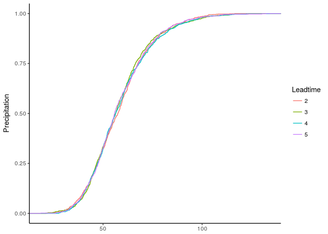
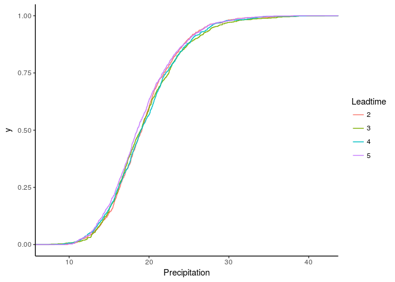
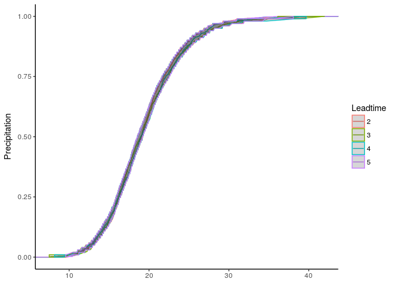
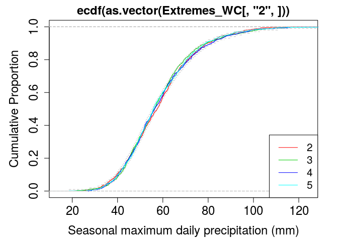
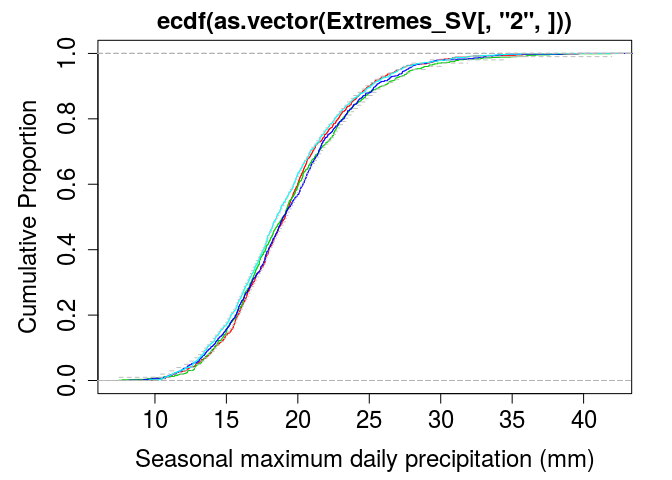
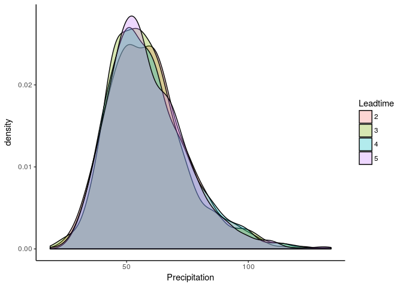
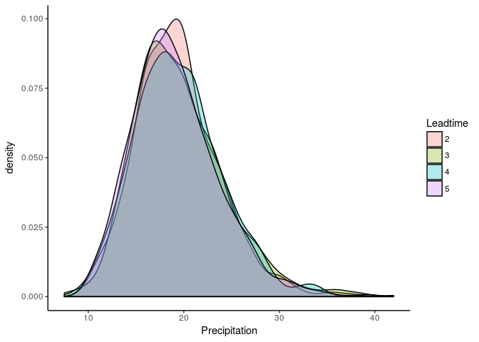
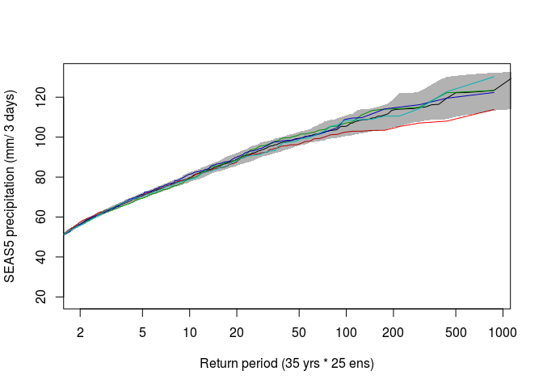
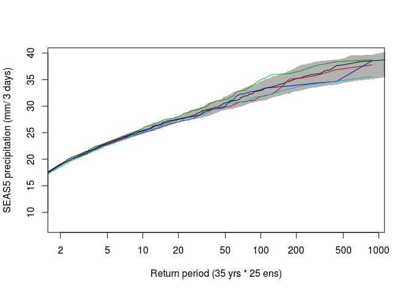

Model stability
================
Timo Kelder
November 12, 2019

In this notebook, we assess the stability of the model over forecast length. Does the statistical distribution of extreme precipitation increase (or decrease) with longer lead times? We assess the distribution of extreme precipitation between different forecast lead times. A block maxima approach is taken, where the extremes are defined as Autumn three-day maximum precipitation values.

Import data and packages
------------------------

``` r
dir='//home/timok/timok/SALIENSEAS/SEAS5/ensex'
plotdir=paste0(dir,'/statistics/multiday/plots')
# dir='/home/timok/ensex'
# plotdir='/home/timok/Documents/ensex/R/graphs'
source('Load_data.R')
```

    ## ── Attaching packages ────────────────────────────────── tidyverse 1.2.1 ──

    ## ✔ tibble  2.1.3     ✔ purrr   0.3.3
    ## ✔ tidyr   1.0.0     ✔ dplyr   0.8.3
    ## ✔ readr   1.1.1     ✔ stringr 1.3.0
    ## ✔ tibble  2.1.3     ✔ forcats 0.3.0

    ## ── Conflicts ───────────────────────────────────── tidyverse_conflicts() ──
    ## ✖ dplyr::arrange()   masks plyr::arrange()
    ## ✖ purrr::compact()   masks plyr::compact()
    ## ✖ dplyr::count()     masks plyr::count()
    ## ✖ dplyr::failwith()  masks plyr::failwith()
    ## ✖ dplyr::filter()    masks stats::filter()
    ## ✖ dplyr::id()        masks plyr::id()
    ## ✖ dplyr::lag()       masks stats::lag()
    ## ✖ dplyr::mutate()    masks plyr::mutate()
    ## ✖ dplyr::rename()    masks plyr::rename()
    ## ✖ dplyr::summarise() masks plyr::summarise()
    ## ✖ dplyr::summarize() masks plyr::summarize()

Plot empirical cumulative distribution functions for each leadtime
------------------------------------------------------------------

We show the ecdf for the west coast of Norway and for Svalbard. The lead times seem similar.

``` r
require(plyr)
names(dimnames(Extremes_WC)) <- c('Member', 'Leadtime', 'Year')
names(dimnames(Extremes_SV)) <- c('Member', 'Leadtime', 'Year')
df_WC=adply(Extremes_WC, 1:3)
df_SV=adply(Extremes_SV, 1:3)

ggplot(df_WC, aes(V1, colour = Leadtime)) + stat_ecdf() +labs(x = NULL, y = 'Precipitation')+
  theme_classic() 
```



``` r
ggplot(df_SV, aes(V1, colour = Leadtime)) + stat_ecdf() +labs(x = 'Precipitation')+
  theme_classic() 
```



We would want to proof that they are similar. Therefore, we want to show the confidence interval of the ecdf of all lead times pooled together. The sample size should be the same as the ecdfs for each lead time, so we bootstrap the pooled leadtimes into series with equal length of the single leadtimes, with n=10000.
I have tried to add these confidence intervals but I dont know whether this is the right way and I dont know how to add these confidence intervals to the ggplot.

``` r
bootstrapped_series_SV=sample(df_SV$V1,size = 875*10000,replace = T) #bootstraps the series of length equal to each lead time (875) with n= 10.000 
bootstrapped_series_WC=sample(df_WC$V1,size = 875*10000,replace = T) #Same for WC
bootstrapped_array_SV=array(bootstrapped_series_SV,dim = c(875,10000)) #Creates an array with 10.000 series of 875 values
bootstrapped_array_WC=array(bootstrapped_series_WC,dim = c(875,10000)) #Creates an array with 10.000 series of 875 values

##Here I dont know how to get the 5 and 95% confidence intervals for the ecdf from the 10.000 series. Now, I calculate the quantiles over the ecdf for each of the series, and then calculate the lower and upper interval for the quantiles over the 10.000 values. 
ecdf_datavalues <- function(x) { ##write a function to obtain the quantiles for the ecdf distribution  
  b=ecdf(x)
  return(quantile(b,probs = seq(0,1,0.01))) #returns the quantiles for the empirical distribution
}

ecdfs_SV=apply(bootstrapped_array_SV, MARGIN = 2,ecdf_datavalues) #apply the ecdf function to each of the 10.000 series
ecdfs_WC=apply(bootstrapped_array_WC, MARGIN = 2,ecdf_datavalues) #apply the ecdf function to each of the 10.000 series

CI <- function(x) {
quantile(x,probs=c(0.05,0.95))  ##lower and upper interval
}  

#calculate the lower and upper interval from the 10.000 values for each quantile. 
ci_WC=apply(ecdfs_WC, MARGIN = 1,CI)
ci_SV=apply(ecdfs_SV, MARGIN = 1,CI)

#And calculate their ecdfs 
lower_SV=ecdf(ci_SV[1,])
upper_SV=ecdf(ci_SV[2,])


#It duplicates the confidence interval because it is sorted in color=Leadtime. Tips how to work around this?
ggplot(df_SV, aes(V1, colour = Leadtime)) + stat_ecdf() +labs(x = NULL, y = 'Precipitation')+ 
  geom_ribbon(aes(x=df_SV$V1,ymin = lower_SV(df_SV$V1),ymax = upper_SV(df_SV$V1)),alpha = 0.2)+
  theme_classic()
```



``` r
# ggsave(p2, filename = paste0(dir,"/statistics/multiday/plots/Stability.png"), dpi = 100, type = "cairo")

###I cant do it with ggplot.. Tips? :)
```

So instead lets try base R..

``` r
#Try base R

# png(paste0('//home/timok/timok/SALIENSEAS/SEAS5/ensex/statistics/multiday/plots/Drift_WC_ecdf.png'),type='cairo')
par(mar=c(4.5,5.1,2.1,2.1),cex.axis=1.5, cex.lab=1.5,cex.main=1.5)

#Plot the ecdf for the first lead time
plot(ecdf(as.vector(Extremes_WC[,'2',])), 
     col=2,
     xlab="Seasonal maximum daily precipitation (mm)",
     ylab="Cumulative Proportion",
     cex=0)
##Add the other three
for (ld in 3:5){
  lines(ecdf(as.vector(Extremes_WC[,as.character(ld),])),col=ld,cex=0)
}

#And add the confidence intervals
lines(ecdf(ci_WC[1,]), do.points=F,lty=2,col='grey')
lines(ecdf(ci_WC[2,]), do.points=F,lty = 2,col='grey')

legend('bottomright',
       legend=as.character(2:5),  # text in the legend
       col=2:5,  # point colors
       lty=1,
       cex=1.3,
       bg='white')  # specify the point type to be a square
```



``` r
# dev.off()

#And for Svalbard
plot(ecdf(as.vector(Extremes_SV[,'2',])),col=2,xlab="Seasonal maximum daily precipitation (mm)",ylab="Cumulative Proportion",cex=0)
for (ld in 3:5){lines(ecdf(as.vector(Extremes_SV[,as.character(ld),])),col=ld,cex=0)}
lines(ecdf(ci_SV[1,]), do.points=F,lty=2,col='grey')
lines(ecdf(ci_SV[2,]), do.points=F,lty = 2,col='grey')
```



In addition to the cumulative plot, this is a density plot. Without ci..

``` r
ggplot(df_WC, aes(x = V1, fill = Leadtime)) +
  labs(x = 'Precipitation')+
  geom_density(alpha = .3)+
  theme_classic()
```



``` r
ggplot(df_SV, aes(x = V1, fill = Leadtime)) +
  labs(x = 'Precipitation')+
  geom_density(alpha = .3)+
  theme_classic()
```



``` r
# ggsave(p2, filename = paste0(dir,"/statistics/multiday/plots/Stability.png"), dpi = 100, type = "cairo")
```

What about empirical return value plots?

``` r
rps=35*25*4/1:(35*25*4) #Return periods

empirical_returnvalues <- function(x) { ##write a function to obtain the quantiles for the ecdf distribution  
  return(quantile(x,probs = 1-1/(rps))) #returns the quantiles for the return values (1-1/return period)
}

Rvs_WC=apply(bootstrapped_array_WC, MARGIN = 2,empirical_returnvalues) #apply the ecdf function to each of the 10.000 series
Rvs_SV=apply(bootstrapped_array_SV, MARGIN = 2,empirical_returnvalues) #apply the ecdf function to each of the 10.000 series

#calculate the lower and upper interval from the 10.000 values for each quantile. 
ci_rvs_WC=apply(Rvs_WC, MARGIN = 1,CI)
ci_rvs_SV=apply(Rvs_SV, MARGIN = 1,CI)

# png(paste0('//home/timok/timok/SALIENSEAS/SEAS5/ensex/statistics/multiday/plots/Stability_rv.png'),type='cairo')

##plot for WC
plot(rps,quantile(Extremes_WC,1-1/(rps),type=7),type='l',xlim = c(2,875),ylab='SEAS5 precipitation (mm/ 3 days)',
     xlab = paste0('Return period (35 yrs * 25 ens)'),log = 'x')
for (i in 2:5){lines(35*25/1:(35*25),quantile(Extremes_WC[,as.character(i),],1-1/(35*25/1:(35*25)),type=7),col=i)}

polygon(c(rps, rev(rps)), c(ci_rvs_WC[2,], rev(ci_rvs_WC[1,])),col = rgb(0,0,0,alpha = 0.3), border = NA)
```



``` r
# dev.off()

#and for Svalbard
plot(rps,quantile(Extremes_SV,1-1/(rps),type=7),type='l',xlim = c(2,875),ylab='SEAS5 precipitation (mm/ 3 days)',
     xlab = paste0('Return period (35 yrs * 25 ens)'),log = 'x')
for (i in 2:5){lines(35*25/1:(35*25),quantile(Extremes_SV[,as.character(i),],1-1/(35*25/1:(35*25)),type=7),col=i)}

polygon(c(rps, rev(rps)), c(ci_rvs_SV[2,], rev(ci_rvs_SV[1,])),col = rgb(0,0,0,alpha = 0.3), border = NA)
```


