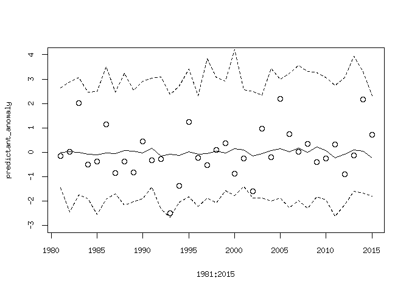

Predictive\_skill
================
Timo Kelder
October 19, 2019

Load the required packages

``` r
library('ncdf4')
```

Import data
-----------

Open the forecasted and observed SON maxima

``` r
dir='//home/timok/timok/SALIENSEAS/SEAS5'
nc=nc_open(paste0(dir,'/ensex/Extremes/Extremes.nc'))#for lonlat
nc_sv=nc_open(paste0(dir,'/ensex/Extremes/Extremes_SV.nc'))#for lonlat
nc_obs=nc_open(paste0(dir,'/ensex/Extremes/SeNorge.nc'))#for lonlat

Extremes_WC=ncvar_get(nc)
Extremes_SV=ncvar_get(nc_sv)
Extremes_obs=ncvar_get(nc_obs)
# Extremes_SV
dim(Extremes_WC) # 25 4 35 Ensemble Leadtime Year 
```

    ## [1] 25  4 35

``` r
#There is an error that the dimnames do not get saved from Xarray to_netcdf. Set the dimnames here 
dimnames(Extremes_WC) = list(as.character(0:24),as.character(2:5),as.character(1981:2015))
dimnames(Extremes_SV) = list(as.character(0:24),as.character(2:5),as.character(1981:2015))
dimnames(Extremes_obs) = list(as.character(1957:2018))
```

Define predictor and predictant and standardize

``` r
predictant=as.vector(Extremes_obs[as.character(1981:2015)]) #First member, first leadtime that we use in this study
predictor=apply(Extremes_WC,MARGIN = c(2,3),FUN=mean) #predictor['2','1987']

#Standarized anomaly
calc_anomaly <- function(variable) {
  (variable-mean(variable))/sd(variable)
}
predictor_anomaly=apply(predictor,MARGIN = 1 , FUN=calc_anomaly)
predictant_anomaly=calc_anomaly(predictant)
```

Visualize the data
------------------

Plot the observations and the ensemble means of each lead time... Auch Clearly, the method cannot be used to calculate design values without downscaling.

``` r
plot(1981:2015,predictant,type='l')
lines(1981:2015,predictor['2',],col='blue')
lines(1981:2015,predictor['3',],col='blue')
lines(1981:2015,predictor['4',],col='blue')
lines(1981:2015,predictor['5',],col='blue')
```


And now the anomalies. This is the same as linear bias correction, if I am not mistaken

``` r
plot(1981:2015,predictant_anomaly,type='l')
lines(1981:2015,predictor_anomaly[,'2'],col='blue')
lines(1981:2015,predictor_anomaly[,'3'],col='blue')
lines(1981:2015,predictor_anomaly[,'4'],col='blue')
lines(1981:2015,predictor_anomaly[,'5'],col='blue')
```


Correlations
------------

Calculate the correlation between the anomalies of the ensemble mean of each lead time and the observations

``` r
#Use spearman to avoid normality assumptions
cor_coeff='spearman'
correlation_test <- function(predictor_anomaly) {
  
correlation=cor.test(predictant_anomaly,predictor_anomaly,alternative = 'two.sided',method = cor_coeff) #alternative hypothesis is that the population correlation is greater than 0. -> we don't expect negative correlations? 
return(correlation$estimate)}# correlation$p.value
# correlation$estimate

apply(predictor_anomaly,MARGIN = 2 , FUN=correlation_test)
```

    ##          2          3          4          5 
    ## -0.1084034  0.1282913  0.2142857  0.1011204

What about the correlation between the different leadtimes?

``` r
predictant_anomaly=predictor_anomaly[,'2']
apply(predictor_anomaly,MARGIN = 2 , FUN=correlation_test)
```

    ##           2           3           4           5 
    ##  1.00000000 -0.19719888 -0.02408964 -0.06218487

``` r
predictant_anomaly=predictor_anomaly[,'3']
apply(predictor_anomaly,MARGIN = 2 , FUN=correlation_test)
```

    ##           2           3           4           5 
    ## -0.19719888  1.00000000  0.04789916  0.16134454

``` r
predictant_anomaly=predictor_anomaly[,'4']
apply(predictor_anomaly,MARGIN = 2 , FUN=correlation_test)
```

    ##           2           3           4           5 
    ## -0.02408964  0.04789916  1.00000000  0.36414566

``` r
predictant_anomaly=predictor_anomaly[,'5']
apply(predictor_anomaly,MARGIN = 2 , FUN=correlation_test)
```

    ##           2           3           4           5 
    ## -0.06218487  0.16134454  0.36414566  1.00000000

The correlations are very small. Does it even make sense to continue and calculate the ratio of predictable components? I don't think so. The main question I have is: Do we trust the trends in the anomalies of the model to be representative of trends in reality (the anomalies of the observations), even if there is no skill?

``` r
#obtain observations again
predictant_anomaly=calc_anomaly(predictant)

plot(1981:2015,predictant_anomaly, ylim = c(-3,4))
Model_anomalies=apply(Extremes_WC,MARGIN = c(1,2), FUN=calc_anomaly)
lines(1981:2015,apply(Model_anomalies,MARGIN=1,FUN=mean))
lines(1981:2015,apply(Model_anomalies,MARGIN=1,FUN=min),lty='dashed')
lines(1981:2015,apply(Model_anomalies,MARGIN=1,FUN=max),lty='dashed')
```


