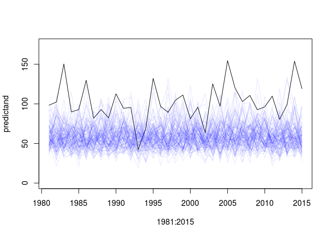
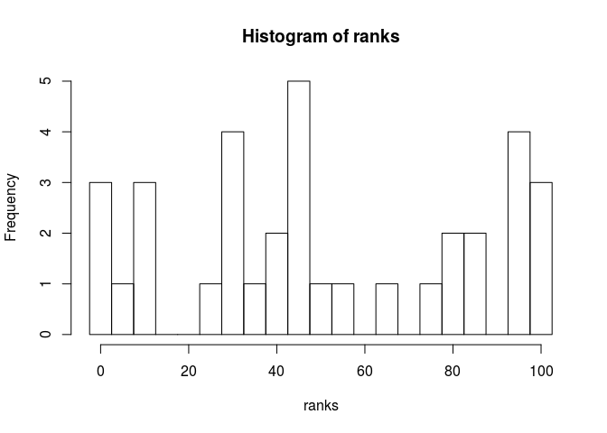
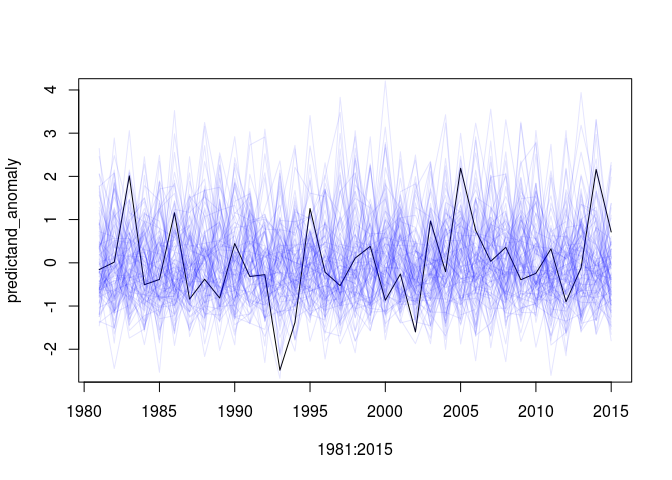

Predictive skill
================
Timo Kelder
October 19, 2019

In this notebook, we will first show the forecasts of the Norwegian West Coast compared to observed values and then we will assess the skill of the forecasts.

Import data and packages
------------------------

``` r
dir='//home/timok/timok/SALIENSEAS/SEAS5/ensex'
plotdir=paste0(dir,'/statistics/multiday/plots')
# dir='/home/timok/ensex'
# plotdir='/home/timok/Documents/ensex/R/graphs'
source('Load_data.R')
```

    ## ── Attaching packages ────────────────────────────────── tidyverse 1.2.1 ──

    ## ✔ tibble  2.1.3     ✔ purrr   0.3.3
    ## ✔ tidyr   1.0.0     ✔ dplyr   0.8.3
    ## ✔ readr   1.1.1     ✔ stringr 1.3.0
    ## ✔ tibble  2.1.3     ✔ forcats 0.3.0

    ## ── Conflicts ───────────────────────────────────── tidyverse_conflicts() ──
    ## ✖ dplyr::arrange()   masks plyr::arrange()
    ## ✖ purrr::compact()   masks plyr::compact()
    ## ✖ dplyr::count()     masks plyr::count()
    ## ✖ dplyr::failwith()  masks plyr::failwith()
    ## ✖ dplyr::filter()    masks stats::filter()
    ## ✖ dplyr::id()        masks plyr::id()
    ## ✖ dplyr::lag()       masks stats::lag()
    ## ✖ dplyr::mutate()    masks plyr::mutate()
    ## ✖ dplyr::rename()    masks plyr::rename()
    ## ✖ dplyr::summarise() masks plyr::summarise()
    ## ✖ dplyr::summarize() masks plyr::summarize()

SEAS5 compared to SeNorge
-------------------------

Plot the observations and the forecasts for:

-   The raw values for the observations and the forecasts
-   The mean bias corrected forecasts
-   The standardized anomaly for the forecasts and the observations

``` r
par(mfrow=c(3,1))
plot(1981:2015,predictand,type='l',ylim=c(0,175), ylab = 'SON three-day precipitation maxima',xlab = '',xaxt='n')
for (mbr in 1:25){
  for (ld in 1:4){
    lines(1981:2015,Extremes_WC[mbr,ld,],col=alpha('blue',0.1))}}
axis(side = 1,1981:2015,labels = F)


plot(1981:2015,predictand-mean(predictand),type='l',ylim=c(-60,80),ylab = 'Anomalies',xlab = '',xaxt='n')
for (mbr in 1:25){
  for (ld in 1:4){
    lines(1981:2015,Extremes_WC[mbr,ld,]-mean(Extremes_WC),col=alpha('blue',0.1))}}
axis(side = 1,1981:2015,labels = F)

plot(1981:2015,predictand_anomaly,type='l',ylim = c(-2.5,4),ylab='Standardized anomalies',xlab = '')
for (mbr in 1:25){
  for (ld in 1:4){
    lines(1981:2015,calc_anomaly(Extremes_WC[mbr,ld,]),col=alpha('blue',0.1))}}
axis(side = 1,1981:2015,labels = F)
```


To compare the obervation with the simulations, we show the rank histogram for each of the three plots. The rank histograms illustrates on what rank the observations lie compared to all forecasts. If the simulations are not biased and represent plausible realizations of reality, the observations would be randomly distributed over the range of simulations and the rank histogram would be flat.

From both the time series and histogram plots, it is clear that the forecast have a lower bias. When corrected for this mean bias, the ranks of the observations seem to be equally distributed over the forecast ranks.

``` r
rank.histogram <- function(pred,obs=NULL) {
  
  N <- dim(pred)[2]
  K <- dim(pred)[1]
  
  ranks <- apply(rbind(obs, pred), 2, rank, ties.method="random")[1, ]
  rank.hist <- hist(ranks, breaks=seq(-2.5, K+2.5,5))[["counts"]]
}

# apply(pred, MARGIN = 3, rank.histogram) #What am I doing wrong?

rank.histogram(rbind(Extremes_WC[,1,],Extremes_WC[,2,],Extremes_WC[,3,],Extremes_WC[,4,]),predictand)
```



``` r
rank.histogram(rbind(Extremes_WC[,1,],Extremes_WC[,2,],Extremes_WC[,3,],Extremes_WC[,4,])-mean(Extremes_WC),predictand-mean(predictand))
```



``` r
pred=apply(Extremes_WC,MARGIN = c(1,2) , FUN=calc_anomaly)

rank.histogram <- function(pred,obs=NULL) {
  N <- dim(pred)[1]
  K <- dim(pred)[2]
  
  ranks <- apply(cbind(obs, pred), 1, rank, ties.method="random")[1, ]
  rank.hist <- hist(ranks, breaks=seq(-2.5, K+2.5,5))[["counts"]]
}
rank.histogram(cbind(pred[,,1],pred[,,2],pred[,,3],pred[,,4]),predictand_anomaly)
```



Predictive skill
----------------

Then, for the predictive skill, the mean of the forecasts for each leadtime is used for the raw and standardized data.

``` r
plot(1981:2015,predictand,type='l')
lines(1981:2015,predictor['2',],col='blue')
lines(1981:2015,predictor['3',],col='blue')
lines(1981:2015,predictor['4',],col='blue')
lines(1981:2015,predictor['5',],col='blue')
```


``` r
plot(1981:2015,predictand_anomaly,type='l')
lines(1981:2015,predictor_anomaly[,'2'],col='blue')
lines(1981:2015,predictor_anomaly[,'3'],col='blue')
lines(1981:2015,predictor_anomaly[,'4'],col='blue')
lines(1981:2015,predictor_anomaly[,'5'],col='blue')
```


We compare the anomaly of the observations with forecasts for each of the lead times. There is not much of a correlation and the lead times are not significantly different.

``` r
df <- data.frame(predictand_anomaly,predictor_anomaly) %>%
  select(predictand_anomaly, X2,X3,X4,X5) %>%
  gather(key = "variable", value = "value", -predictand_anomaly)

p= ggplot(df, aes(x=predictand_anomaly, y=value, color=variable, shape=variable)) +
  geom_point() + 
  geom_smooth(method=lm)+
  xlim(-2.5, 2.5) +
  ylim(-2.5, 2.5) +
  theme_classic() 

# p1 = p + scale_color_grey()
p2 = p + scale_color_brewer(palette="Dark2")
# p1
p2
```

    ## Warning: Removed 1 rows containing non-finite values (stat_smooth).

    ## Warning: Removed 1 rows containing missing values (geom_point).


We calculate the correlation test between the anomalies of the ensemble mean of each lead time and the observations

``` r
#Use spearman to avoid normality assumptions
cor_coeff='spearman'
correlation_test <- function(predictor_anomaly) {
  
correlation=cor.test(predictand_anomaly,predictor_anomaly,alternative = 'two.sided',method = cor_coeff) #alternative hypothesis is that the population correlation is greater than 0. -> we don't expect negative correlations? 
return(c(correlation$estimate,correlation$p.value))}# 
apply(predictor_anomaly,MARGIN = 2 , FUN=correlation_test)
```

    ##              2         3         4         5
    ## rho -0.1084034 0.1282913 0.2142857 0.1011204
    ##      0.5339318 0.4611665 0.2155849 0.5619098

The correlations are very small. Does it even make sense to continue and calculate the ratio of predictable components? I don't think so. The main question I have is: Do we trust the trends in the anomalies of the model to be representative of trends in reality (the anomalies of the observations), even if there is no skill? See the forecast reliability notebook.

A little extra: What about the correlation between the different leadtimes? They also have very small correlations

``` r
predictand_anomaly=predictor_anomaly[,'2']
apply(predictor_anomaly,MARGIN = 2 , FUN=correlation_test)
```

    ##     2          3           4           5
    ## rho 1 -0.1971989 -0.02408964 -0.06218487
    ##     0  0.2551188  0.89078156  0.72187760

``` r
predictand_anomaly=predictor_anomaly[,'3']
apply(predictor_anomaly,MARGIN = 2 , FUN=correlation_test)
```

    ##              2 3          4         5
    ## rho -0.1971989 1 0.04789916 0.1613445
    ##      0.2551188 0 0.78415070 0.3530598

``` r
predictand_anomaly=predictor_anomaly[,'4']
apply(predictor_anomaly,MARGIN = 2 , FUN=correlation_test)
```

    ##               2          3 4          5
    ## rho -0.02408964 0.04789916 1 0.36414566
    ##      0.89078156 0.78415070 0 0.03217808

``` r
predictand_anomaly=predictor_anomaly[,'5']
apply(predictor_anomaly,MARGIN = 2 , FUN=correlation_test)
```

    ##               2         3          4 5
    ## rho -0.06218487 0.1613445 0.36414566 1
    ##      0.72187760 0.3530598 0.03217808 0
