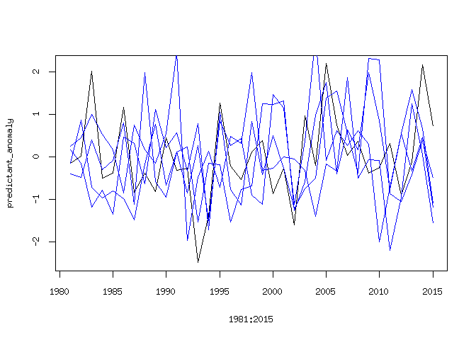

Predictive\_skill
================
Timo Kelder
October 19, 2019

Load the required packages

``` r
library('ncdf4')
library(extRemes)
```

    ## Loading required package: Lmoments

    ## Loading required package: distillery

    ## Loading required package: car

    ## Loading required package: carData

    ## 
    ## Attaching package: 'extRemes'

    ## The following objects are masked from 'package:stats':
    ## 
    ##     qqnorm, qqplot

``` r
library(scatterplot3d)
```

Open the forecasted and observed SON maxima

``` r
dir='//home/timok/timok/SALIENSEAS/SEAS5'
nc=nc_open(paste0(dir,'/ensex/Extremes/Extremes.nc'))#for lonlat
nc_sv=nc_open(paste0(dir,'/ensex/Extremes/Extremes_SV.nc'))#for lonlat

Extremes_WC=ncvar_get(nc)
Extremes_SV=ncvar_get(nc_sv)
# Extremes_SV
dim(Extremes_WC) # 25 4 35 Ensemble Leadtime Year 
```

    ## [1] 25  4 35

``` r
#There is an error that the dimnames do not get saved from Xarray to_netcdf. Set the dimnames here 
dimnames(Extremes_WC) = list(as.character(0:24),as.character(2:5),as.character(1981:2015))
dimnames(Extremes_SV) = list(as.character(0:24),as.character(2:5),as.character(1981:2015))

Extremes_array= Extremes_WC
```

Define predictor and predictant and standardize

``` r
predictant=as.vector(Extremes_array[1,'2',]) #First member, first leadtime that we use in this study
predictor=apply(Extremes_array,MARGIN = c(2,3),FUN=mean) #predictor['2','1987']

#Standarized anomaly
calc_anomaly <- function(variable) {
  (variable-mean(variable))/sd(variable)
}
predictor_anomaly=apply(predictor,MARGIN = 1 , FUN=calc_anomaly)

# predictant_anomaly=
```

Calculate the correlation

``` r
#Use spearman to avoid normality assumptions
cor_coeff='spearman'
correlation_test <- function(predictant_anomaly,predictor_anomaly) {
  
correlation=cor.test(predictant_anomaly,predictor_anomaly,alternative = 'two.sided',method = cor_coeff) #alternative hypothesis is that the population correlation is greater than 0. -> we don't expect negative correlations? 
return(correlation$estimate)}# correlation$p.value
# correlation$estimate
```

``` r
plot(1981:2015,predictor_anomaly[,'2'])
```


