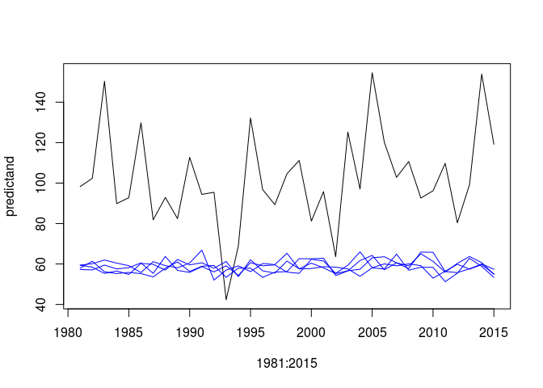
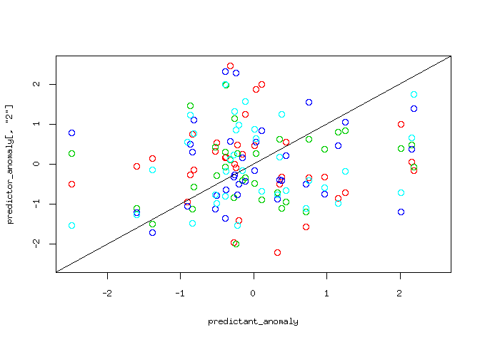
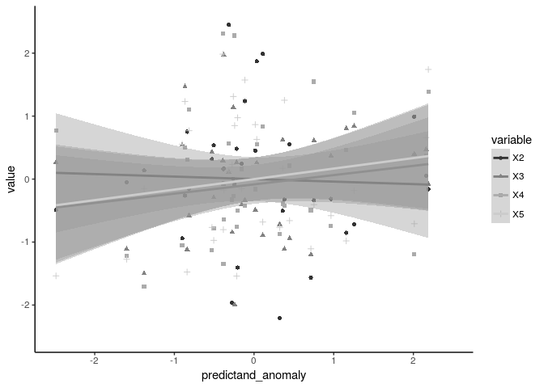

Predictive\_skill
================
Timo Kelder
October 19, 2019

Load the required packages

``` r
library('ncdf4')
library('ggplot2')
library("tidyverse")
```

    ## ── Attaching packages ────────────────────────────────── tidyverse 1.2.1 ──

    ## ✔ tibble  2.1.3     ✔ purrr   0.3.3
    ## ✔ tidyr   1.0.0     ✔ dplyr   0.8.3
    ## ✔ readr   1.1.1     ✔ stringr 1.3.0
    ## ✔ tibble  2.1.3     ✔ forcats 0.3.0

    ## ── Conflicts ───────────────────────────────────── tidyverse_conflicts() ──
    ## ✖ dplyr::filter() masks stats::filter()
    ## ✖ dplyr::lag()    masks stats::lag()

``` r
options(bitmapType = 'cairo')
```

Import data
-----------

Open the forecasted and observed SON maxima

``` r
dir='//home/timok/timok/SALIENSEAS/SEAS5'
nc=nc_open(paste0(dir,'/ensex/Extremes/Extremes.nc'))#for lonlat
nc_sv=nc_open(paste0(dir,'/ensex/Extremes/Extremes_SV.nc'))#for lonlat
nc_obs=nc_open(paste0(dir,'/ensex/Extremes/SeNorge.nc'))#for lonlat

Extremes_WC=ncvar_get(nc)
Extremes_SV=ncvar_get(nc_sv)
Extremes_obs=ncvar_get(nc_obs)
# Extremes_SV
dim(Extremes_WC) # 25 4 35 Ensemble Leadtime Year 
```

    ## [1] 25  4 35

``` r
#There is an error that the dimnames do not get saved from Xarray to_netcdf. Set the dimnames here 
dimnames(Extremes_WC) = list(as.character(0:24),as.character(2:5),as.character(1981:2015))
dimnames(Extremes_SV) = list(as.character(0:24),as.character(2:5),as.character(1981:2015))
dimnames(Extremes_obs) = list(as.character(1957:2018))
```

Define predictor and predictand and standardize

``` r
predictand=as.vector(Extremes_obs[as.character(1981:2015)]) #First member, first leadtime that we use in this study
predictor=apply(Extremes_WC,MARGIN = c(2,3),FUN=mean) #predictor['2','1987']

#Standarized anomaly
calc_anomaly <- function(variable) {
  (variable-mean(variable))/sd(variable)
}
predictor_anomaly=apply(predictor,MARGIN = 1 , FUN=calc_anomaly)
predictand_anomaly=calc_anomaly(predictand)
```

Visualize the data
------------------

Plot the observations and the ensemble means of each lead time... Auch Clearly, the method cannot be used to calculate design values without downscaling.

``` r
plot(1981:2015,predictand,type='l')
lines(1981:2015,predictor['2',],col='blue')
lines(1981:2015,predictor['3',],col='blue')
lines(1981:2015,predictor['4',],col='blue')
lines(1981:2015,predictor['5',],col='blue')
```



And now the anomalies. This is the same as linear bias correction, if I am not mistaken

``` r
plot(1981:2015,predictand_anomaly,type='l')
lines(1981:2015,predictor_anomaly[,'2'],col='blue')
lines(1981:2015,predictor_anomaly[,'3'],col='blue')
lines(1981:2015,predictor_anomaly[,'4'],col='blue')
lines(1981:2015,predictor_anomaly[,'5'],col='blue')
```


Comparing the anomalies.

``` r
plot(predictand_anomaly,predictor_anomaly[,'2'],type='p',col=2,ylim = c(-2.5,2.5),xlim = c(-2.5,2.5))
# points(predictand_anomaly,predictor_anomaly[,'2'],col='blue')
points(predictand_anomaly,predictor_anomaly[,'3'],col=3)
points(predictand_anomaly,predictor_anomaly[,'4'],col=4)
points(predictand_anomaly,predictor_anomaly[,'5'],col=5)
lines(c(-3,3),c(-3,3))
```



Correlations
------------

Calculate the correlation between the anomalies of the ensemble mean of each lead time and the observations

``` r
#Use spearman to avoid normality assumptions
cor_coeff='spearman'
correlation_test <- function(predictor_anomaly) {
  
correlation=cor.test(predictand_anomaly,predictor_anomaly,alternative = 'two.sided',method = cor_coeff) #alternative hypothesis is that the population correlation is greater than 0. -> we don't expect negative correlations? 
return(correlation$estimate)}# correlation$p.value
# correlation$estimate

apply(predictor_anomaly,MARGIN = 2 , FUN=correlation_test)
```

    ##          2          3          4          5 
    ## -0.1084034  0.1282913  0.2142857  0.1011204

What about the correlation between the different leadtimes?

``` r
predictand_anomaly=predictor_anomaly[,'2']
apply(predictor_anomaly,MARGIN = 2 , FUN=correlation_test)
```

    ##           2           3           4           5 
    ##  1.00000000 -0.19719888 -0.02408964 -0.06218487

``` r
predictand_anomaly=predictor_anomaly[,'3']
apply(predictor_anomaly,MARGIN = 2 , FUN=correlation_test)
```

    ##           2           3           4           5 
    ## -0.19719888  1.00000000  0.04789916  0.16134454

``` r
predictand_anomaly=predictor_anomaly[,'4']
apply(predictor_anomaly,MARGIN = 2 , FUN=correlation_test)
```

    ##           2           3           4           5 
    ## -0.02408964  0.04789916  1.00000000  0.36414566

``` r
predictand_anomaly=predictor_anomaly[,'5']
apply(predictor_anomaly,MARGIN = 2 , FUN=correlation_test)
```

    ##           2           3           4           5 
    ## -0.06218487  0.16134454  0.36414566  1.00000000

The correlations are very small. Does it even make sense to continue and calculate the ratio of predictable components? I don't think so. The main question I have is: Do we trust the trends in the anomalies of the model to be representative of trends in reality (the anomalies of the observations), even if there is no skill?

``` r
#obtain observations again
predictand_anomaly=calc_anomaly(predictand)

require(extrafont)
```

    ## Loading required package: extrafont

    ## Registering fonts with R

``` r
extrafont::font_import()  ## first time could take a while
```

    ## Importing fonts may take a few minutes, depending on the number of fonts and the speed of the system.
    ## Continue? [y/n]

    ## Exiting.

``` r
extrafont::loadfonts()
```

    ## Padauk already registered with pdfFonts().

    ## Padauk Book already registered with pdfFonts().

    ## Abyssinica SIL already registered with pdfFonts().

    ## Amiri already registered with pdfFonts().

    ## Amiri Quran already registered with pdfFonts().

    ## Aristarcoj already registered with pdfFonts().

    ## Bitstream Vera Sans already registered with pdfFonts().

    ## Bitstream Vera Sans Mono already registered with pdfFonts().

    ## Bitstream Vera Serif already registered with pdfFonts().

    ## More than one version of regular/bold/italic found for Caladea. Skipping setup for this font.

    ## Carlito already registered with pdfFonts().

    ## cmex10 already registered with pdfFonts().

    ## cmmi10 already registered with pdfFonts().

    ## cmr10 already registered with pdfFonts().

    ## cmsy10 already registered with pdfFonts().

    ## More than one version of regular/bold/italic found for Comfortaa. Skipping setup for this font.

    ## DejaVu Sans already registered with pdfFonts().

    ## DejaVu Sans Light already registered with pdfFonts().

    ## DejaVu Sans Condensed already registered with pdfFonts().

    ## DejaVu Sans Mono already registered with pdfFonts().

    ## DejaVu Serif already registered with pdfFonts().

    ## DejaVu Serif Condensed already registered with pdfFonts().

    ## EB Garamond 08 already registered with pdfFonts().

    ## EB Garamond 08 SC already registered with pdfFonts().

    ## EB Garamond 12 already registered with pdfFonts().

    ## EB Garamond Initials Fill1 already registered with pdfFonts().

    ## EB Garamond Initials Fill2 already registered with pdfFonts().

    ## esint10 already registered with pdfFonts().

    ## eufm10 already registered with pdfFonts().

    ## FontAwesome already registered with pdfFonts().

    ## FreeMono already registered with pdfFonts().

    ## FreeSans already registered with pdfFonts().

    ## FreeSerif already registered with pdfFonts().

    ## Garuda already registered with pdfFonts().

    ## Gentium already registered with pdfFonts().

    ## GentiumAlt already registered with pdfFonts().

    ## Gentium Basic already registered with pdfFonts().

    ## Gentium Book Basic already registered with pdfFonts().

    ## Gentium Plus already registered with pdfFonts().

    ## IPAexGothic already registered with pdfFonts().

    ## IPAexMincho already registered with pdfFonts().

    ## IPAGothic already registered with pdfFonts().

    ## IPAMincho already registered with pdfFonts().

    ## IPAPGothic already registered with pdfFonts().

    ## IPAPMincho already registered with pdfFonts().

    ## Junicode already registered with pdfFonts().

    ## KacstArt already registered with pdfFonts().

    ## KacstBook already registered with pdfFonts().

    ## KacstDecorative already registered with pdfFonts().

    ## KacstDigital already registered with pdfFonts().

    ## KacstFarsi already registered with pdfFonts().

    ## KacstLetter already registered with pdfFonts().

    ## KacstNaskh already registered with pdfFonts().

    ## KacstOffice already registered with pdfFonts().

    ## KacstOne already registered with pdfFonts().

    ## KacstPen already registered with pdfFonts().

    ## KacstPoster already registered with pdfFonts().

    ## KacstQurn already registered with pdfFonts().

    ## KacstScreen already registered with pdfFonts().

    ## KacstTitle already registered with pdfFonts().

    ## KacstTitleL already registered with pdfFonts().

    ## Khmer OS already registered with pdfFonts().

    ## Khmer OS System already registered with pdfFonts().

    ## More than one version of regular/bold/italic found for Kinnari. Skipping setup for this font.

    ## Laksaman already registered with pdfFonts().

    ## Lato Black already registered with pdfFonts().

    ## Lato already registered with pdfFonts().

    ## Lato Hairline already registered with pdfFonts().

    ## Lato Heavy already registered with pdfFonts().

    ## Lato Light already registered with pdfFonts().

    ## Lato Medium already registered with pdfFonts().

    ## Lato Semibold already registered with pdfFonts().

    ## Lato Thin already registered with pdfFonts().

    ## Liberation Mono already registered with pdfFonts().

    ## Liberation Sans already registered with pdfFonts().

    ## Liberation Sans Narrow already registered with pdfFonts().

    ## Liberation Serif already registered with pdfFonts().

    ## LKLUG already registered with pdfFonts().

    ## Lohit Punjabi already registered with pdfFonts().

    ## Loma already registered with pdfFonts().

    ## mry_KacstQurn already registered with pdfFonts().

    ## msam10 already registered with pdfFonts().

    ## msbm10 already registered with pdfFonts().

    ## NanumBarunGothic already registered with pdfFonts().

    ## NanumGothic already registered with pdfFonts().

    ## NanumMyeongjo already registered with pdfFonts().

    ## More than one version of regular/bold/italic found for Norasi. Skipping setup for this font.

    ## OpenSymbol already registered with pdfFonts().

    ## Phetsarath OT already registered with pdfFonts().

    ## Purisa already registered with pdfFonts().

    ## More than one version of regular/bold/italic found for Roboto. Skipping setup for this font.

    ## More than one version of regular/bold/italic found for Roboto Condensed. Skipping setup for this font.

    ## rsfs10 already registered with pdfFonts().

    ## Saab already registered with pdfFonts().

    ## Sawasdee already registered with pdfFonts().

    ## stmary10 already registered with pdfFonts().

    ## TakaoPGothic already registered with pdfFonts().

    ## Tibetan Machine Uni already registered with pdfFonts().

    ## TlwgMono already registered with pdfFonts().

    ## TlwgTypewriter already registered with pdfFonts().

    ## Tlwg Typist already registered with pdfFonts().

    ## Tlwg Typo already registered with pdfFonts().

    ## Ubuntu already registered with pdfFonts().

    ## Ubuntu Light already registered with pdfFonts().

    ## Ubuntu Condensed already registered with pdfFonts().

    ## Ubuntu Mono already registered with pdfFonts().

    ## More than one version of regular/bold/italic found for Umpush. Skipping setup for this font.

    ## Waree already registered with pdfFonts().

    ## wasy10 already registered with pdfFonts().

``` r
ggplot_font <- extrafont::choose_font(c('Helvetica', "Arial"))

df <- data.frame(predictand_anomaly,predictor_anomaly) %>%
  select(predictand_anomaly, X2,X3,X4,X5) %>%
  gather(key = "variable", value = "value", -predictand_anomaly)
head(df)
```

    ##   predictand_anomaly variable      value
    ## 1        -0.15613196       X2  0.2419030
    ## 2         0.01542491       X2  0.4527957
    ## 3         2.01175916       X2  0.9900532
    ## 4        -0.50590138       X2  0.5379324
    ## 5        -0.38529341       X2  0.1577014
    ## 6         1.15708418       X2 -0.8524378

``` r
# precip_anomalies=data.frame(predictand_anomaly,predictor_anomaly)
p= ggplot(df, aes(x=predictand_anomaly, y=value, color=variable, shape=variable)) +
  geom_point() + 
  geom_smooth(method=lm)+
  xlim(-2.5, 2.5) +
  ylim(-2.5, 2.5) +
  theme_classic() 

p1 = p + scale_color_grey()
p2 = p + scale_color_brewer(palette="Dark2")
p1
```

    ## Warning: Removed 1 rows containing non-finite values (stat_smooth).

    ## Warning: Removed 1 rows containing missing values (geom_point).


``` r
p1
```

    ## Warning: Removed 1 rows containing non-finite values (stat_smooth).

    ## Warning: Removed 1 rows containing missing values (geom_point).



``` r
# ggsave(p2, filename = paste0(dir,"/ensex/statistics/multiday/ggplot.png"), dpi = 300, type = "cairo")
```
