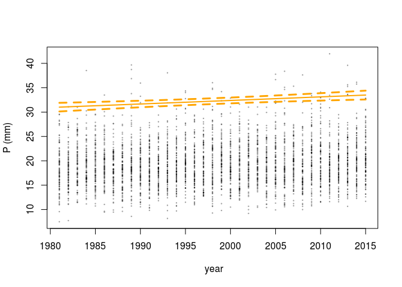

Trend analysis
================
Timo Kelder
November 13, 2019

### Import data and packages

``` r
dir='//home/timok/timok/SALIENSEAS/SEAS5/ensex'
plotdir=paste0(dir,'/statistics/multiday/plots')
# dir='/home/timok/ensex'
# plotdir='/home/timok/Documents/ensex/R/graphs'
source('Load_data.R')
library(extRemes)
```

``` r
require(plyr)
names(dimnames(Extremes_WC)) <- c('Member', 'Leadtime', 'Year')
names(dimnames(Extremes_SV)) <- c('Member', 'Leadtime', 'Year')
df_WC=adply(Extremes_WC, 1:3)
df_SV=adply(Extremes_SV, 1:3)
obs=Extremes_obs[as.character(1981:2015)]

year_vector=as.numeric(levels(df_WC$Year))[df_WC$Year]

# fit0 <- fevd(Extremes_WC) #stationair
fit0_WC <- fevd(df_WC$V1) #stationair
fit1_WC <- fevd(df_WC$V1, location.fun = ~ c(df_WC$Year)) #linear loc. The year series is a factor. We are using the factor to classify the years into the values 1:35, for efficiency.  
fit2_WC <- fevd(df_WC$V1, location.fun = ~ c(df_WC$Year),
               scale.fun = ~ c(df_WC$Year), use.phi = TRUE)
fit2_SV <- fevd(df_SV$V1, location.fun = ~ c(df_SV$Year),
               scale.fun = ~ c(df_SV$Year), use.phi = TRUE)
fit2_obs <- fevd(obs, location.fun = ~ c(1:35),
                  scale.fun = ~ c(1:35), use.phi = TRUE) #linear loc


v_wc <- make.qcov(fit2_WC, vals = list(mu1 = c(1:35),phi1 = c(1:35)))
ci_wc=ci.fevd(fit2_WC,type='return.level',return.period = 100,R = 502, method ="normal",qcov=v_wc)  #method=c("normal","boot", 
v_sv <- make.qcov(fit2_SV, vals = list(mu1 = c(1:35),phi1 = c(1:35)))
ci_sv=ci.fevd(fit2_SV,type='return.level',return.period = 100,R = 502, method ="normal",qcov=v_sv)  #method=c("normal","boot", "proflik") -> only normal works :(
v_obs <- make.qcov(fit2_obs, vals = list(mu1 = c(1:35) ,phi1=c(1:35)))
ci_obs=ci.fevd(fit2_obs,type='return.level',return.period = 100,qcov=v_obs)
 
# par(mar=c(4.5,4.5,2.1,0),mfrow=c(1,3),cex.axis=1.5, cex.lab=1.5, oma=c(0,0,0,1))
plot(year_vector,df_WC$V1,xlab=' year',ylab='P (mm)',ylim = c(0,max(ci_obs[,3])),cex=0.2,col=alpha('black',0.4))
points(1981:2015,obs,col='blue',pch=20)
lines(1981:2015,ci_wc[,3],col='orange',type = 'l',lty=2,lwd=3)
lines(1981:2015,ci_wc[,1],col='orange',type = 'l',lty=2,lwd=3)
lines(1981:2015,ci_wc[,2],col='orange',lwd=2)

lines(1981:2015,ci_obs[,3],col='blue',type = 'l',lty=2,lwd=2)
lines(1981:2015,ci_obs[,1],col='blue',type = 'l',lty=2,lwd=2)
lines(1981:2015,ci_obs[,2],col='blue')
legend("topleft", legend=c("20 yr Values", "95% Intervals","Seasonal Extremes"),
       col=c("blue", "blue",'black'), lty=c(1:2,NA),lwd=c(1:2,NA),pch=c(NA,NA,1),pt.cex=1,box.lty = 1,cex = 1.3)
```


``` r
##Svalbard 
plot(year_vector,df_SV$V1,xlab=' year',ylab='P (mm)',cex=0.2,col=alpha('black',0.4))#,ylim = c(0,max(ci_obs[,3])))
#points(1981:2015,obs,col='blue',pch=20)
lines(1981:2015,ci_sv[,3],col='orange',type = 'l',lty=2,lwd=3)
lines(1981:2015,ci_sv[,1],col='orange',type = 'l',lty=2,lwd=3)
lines(1981:2015,ci_sv[,2],col='orange',lwd=2)
```


